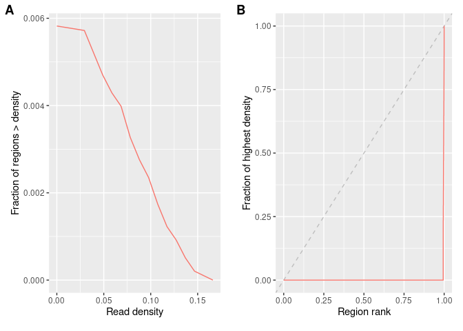
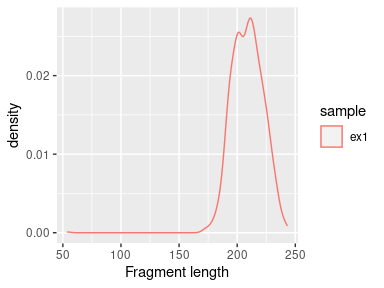

# epiwraps: wrappers for easy epigenomic data visualization

Bioconductor offers power packages for the analysis and visualization of 
(epi)genomic data, however they are often not always easy to approach for users 
without an extensive bioinformatics background. The `epiwraps` package was 
therefore developed as a simpler entry-point to such tasks, providing a simple
interface to the more powerful capabilities of other packages.

# Plotting signals in a region

The `plotSignalTracks` function is a wrapper around the 
*[Gviz](https://bioconductor.org/packages/3.13/Gviz)* package, which plots one or more signals along 
genomic coordinates (in a genome-browser like fashion). 
The function lacks the full flexibility of the *[Gviz](https://bioconductor.org/packages/3.13/Gviz)* 
package, but presents a considerable simpler interface, with automatic default 
parameters, etc. It has two essential arguments: a (named) list of files whose 
signal to display (can be a mixture of bigwig, bam, or bed-like files), and the 
region in which to display the signals (can be given as a GRanges or as a 
string). The function then automatically determines the relevant track type and 
setting from the file types.


```r
library(GenomicRanges)
library(epiwraps)
# get the path to an example bigwig file:
bwf1 <- system.file("extdata/example_rna.bw", package="epiwraps")
plotSignalTracks(list(RNA=bwf1), region="8:22165140-22212326", genomeAxis=TRUE)
```

<!-- -->

```r
# we could plot multiple tracks as follows:
plotSignalTracks(list(track1=bwf1, track2=bwf1), region="8:22165140-22212326")
```

<!-- -->

`GRanges` objects can also be plotted as annotation tracks alongside other data:


```r
myregions=GRanges("8", IRanges(c(22166000,22202300), width=3000))
plotSignalTracks(list(RNA=bwf1, regions=myregions), region="8:22165140-22212326")
```

<!-- -->

Colors, track display types, and such parameters can either be set for all tracks
or for each individual track, for example:


```r
myregions <- GRanges("8", IRanges(c(22166000,22202300), width=3000))
plotSignalTracks(list(RNA=bwf1, regions=myregions), colors=c("red", "black"),
                 region="8:22165140-22212326")
```

<!-- -->


For bam files, we can also plot individual reads:

```r
# we fetch an example bam file:
bam <- system.file("extdata", "ex1.bam", package="Rsamtools")
plotSignalTracks(c("my bam file"=bam), "seq1:1-1500", type="alignments")
```

<!-- -->

## Merging signal from different tracks

In addition to being displayed one below the other, data tracks can be combined
in different ways. To do this, the tracks can simply be given in a nested 
fashion:


```r
plotSignalTracks(list(track1=bwf1, combined=c(bwf1,bwf1)),
                 region="8:22165140-22212326")
```

In this example we are always using the same track, but the first element 
('track1') plots the track alone, while the second ('combined') merges the two 
given tracks. By default, the mean is shown, but this can be controlled through 
the `aggregation` argument. In addition to usual operations, the tracks can be 
overlayed on top of one another (`aggregation='overlay'`), or shown as a 
heatmap (`aggregation='heatmap'`).

## Using an EnsDb object

If an `EnsDb` object is available (see the *[ensembldb](https://bioconductor.org/packages/3.13/ensembldb)* 
package for a description of the class and its methods, and the 
*[AnnotationHub](https://bioconductor.org/packages/3.13/AnnotationHub)* package for a convenient way of 
fetching such annotation objects), two additional options are available: first,
instead of specifying the region as coordinates, one can specify a gene or 
transcript name, and the corresponding region will be fetched. In addition, the
genes or transcripts can be displayed. For example:


```r
# we fetch the GRCh38 Ensembl 103 annotation (this is not run in the vignette,
# as it takes some time to download the annotation the first time is used):
library(AnnotationHub)
ah <- AnnotationHub()
ensdb <- ah[["AH89426"]]
# we plot our previous RNA bigwig file, around the BMP1 locus:
plotSignalTracks(c(coverage=bwf1), region="BMP1", ensdb=ensdb, 
                 transcripts="full")
```


Now we can see that the coverage is nicely restricted to exons, and that some 
transcripts/exons are not expressed as highly as others. The transcripts could 
also have been collapsed into a gene model using `transcripts="collapsed"` (the
default).

To display only the gene track, the first argument can simply be omitted.

## Further track customization

In addition to the `colors` and `type` argument (and a number of others), which 
can customize the appearance of tracks, any additional parameters supported by 
the respective *[Gviz](https://bioconductor.org/packages/3.13/Gviz)* function 
can be passed through the `genes.params` (for Gviz's `GeneRegionTrack`), 
`align.params` (for Gviz's `AlignmentsTrack`, when plotting individual reads), 
or `tracks.params` (for any other Gviz `DataTrack`).

Also, in addition to passing filepaths or `GRanges`, any Gviz track(s) can be 
passed (i.e. objects inheriting the `GdObject` class) can be passed, enabling 
full track customization when needed.

<br/><br/>

# Plotting signals in many regions

Most of the functions described in this section are wrappers around the 
*[EnrichedHeatmap](https://bioconductor.org/packages/3.13/EnrichedHeatmap)* package, which plots genomic signal 
around many regions using heatmaps. The interface here has been simplified, but
for full functionalities and customization it is recommended to have a look at 
the *[EnrichedHeatmap](https://bioconductor.org/packages/3.13/EnrichedHeatmap)* documentation.

Since reading signal across many regions can take some time, the interface has
been split into two step: reading the data matrix, and plotting.

## Reading signal around a set of regions

The `signal2Matrix` function reads genomic signals around the centers of a set
of regions. It can read from bam and BigWig files, although reading from bam 
files is considerably slower. We can showcase it using the previous toy ATAC 
bigwig file:


```r
# we fetch the path to the example bigwig file:
bwf <- system.file("extdata/example_atac.bw", package="epiwraps")
# we load example regions (could be a GRanges or a path to a bed-like file):
regions <- system.file("extdata/example_peaks.bed", package="epiwraps")
# we obtain the matrix of the signal around the regions. For the purpose of this
# example, we'll read twice from the same:
m <- signal2Matrix(c(atac1=bwf, atac2=bwf), regions, extend=1000)
```

```r
lapply(m,dim)
```

```
## $atac1
## [1] 264 200
## 
## $atac2
## [1] 264 200
```
The result is a named list of matrices (more specifically, `normalizedMatrix`
objects, see *[EnrichedHeatmap](https://bioconductor.org/packages/3.13/EnrichedHeatmap)*) with equal dimensions. 
In this example, the matrix has 264 rows/regions, and 200 columns because we
asked to extend 1000bp on either side, and the default bin size is 10bp.

In addition to the arguments explicitly described in the function's help, it
can accept a number of arguments also accepted by the `normalizeToMatrix` 
function (e.g. `smooth=TRUE`). 

When reading multiple files, the `BPPARAM` argument can be used to set 
multi-threading and increase speed.

### Manipulating signal matrices

The list of signal matrices can be manipulated as any list of matrices, for 
instance using subsetting (e.g. `m[1:2]`), but even using transformations, e.g.:


```r
# square-root transform
m2 <- lapply(m, sqrt)
```

For re-normalizing lists of signal matrices, see `?rescaleSignalMatrices` and/or
`?renormalizeBorders`. In addition, signal matrices can be combined either 
manually, or using the following convenience function:


```r
merged <- mergeSignalMatrices(m, aggregation="mean")
```


## Plotting heatmaps

Once the matrices have been created, we can plot heatmaps based on them as 
follows:


```r
plotEnrichedHeatmaps(m)
```

<!-- -->

```r
# we  can use most arguments that are supported by EnrichedHeatmap, e.g.:
plotEnrichedHeatmaps(m, col=c("white","darkred"), cluster_rows=TRUE,
                     show_row_dend=TRUE, top_annotation=FALSE, 
                     row_title="My list of cool regions")
```

<!-- -->
By default, the colorscale is trimmed to prevent most of it being driven by rare
extreme values. This can be controlled via the `trim` argument (which indicates
up to which quantile of data points to keep to establish the colorscale). 
Compare for instance the following two heatmaps:


```r
plotEnrichedHeatmaps(list("trim=1"=m[[1]]), trim=1, scale_title="trim=1",
                     top_annotation=FALSE) +
  plotEnrichedHeatmaps(list("trim=0.99"=m[[1]]), trim=0.99, scale_title="trim=0.99",
                     top_annotation=FALSE) +
  plotEnrichedHeatmaps(list("trim=0.9"=m[[1]]), trim=0.9, 
                       scale_title="trim=0.9", top_annotation=FALSE)
```

<!-- -->
The underlying data is exactly the same, only the color-mapping changes. In the 
left one, which has no trimming, a single very high value at the top forces the
colorscale to extend to high values, even though most of the data is in the 
very low range, resulting in a very dark heatmap. In the one on the right, it's
the opposite: so much is trimmed that many points reach the top of the 
colorscale, resulting in a an 'over-exposed' heatmap. In practice, it is 
advisable to use minimal trimming (e.g. the default is `c(0.01,0.99)`,
as in the corresponding DeepTools function).


## Plotting aggregated signals

It is also possible to plot only the average signals across regions. To do this,
we first melt the signal matrices and then use *[ggplot2](https://CRAN.R-project.org/package=ggplot2)*. The
`meltSignals` function will return a data.frame showing the mean, standard 
deviation, standard error and median at each position relative to the center,
for each sample/matrix:


```r
d <- meltSignals(m)
head(d)
```

```
##   position sample       mean         SD          SE     median
## 1    -1000  atac1 0.05497661 0.04381686 0.002696741 0.04595237
## 2     -990  atac1 0.05578699 0.04714077 0.002901314 0.04888547
## 3     -980  atac1 0.05548330 0.04692492 0.002888029 0.04470801
## 4     -970  atac1 0.05568262 0.04745326 0.002920547 0.04497465
## 5     -960  atac1 0.05592874 0.04809529 0.002960061 0.03910840
## 6     -950  atac1 0.05677649 0.04775387 0.002939048 0.04741890
```
This can then be used for plotting, e.g.:


```r
library(ggplot2)
ggplot(d, aes(position, mean, colour=sample)) + 
  geom_vline(xintercept=0, linetype="dashed") + geom_line(lwd=2)
```

<!-- -->


# Quality control

## Coverage statistics

Coverage statistics give an overview of how the reads are distributed across 
the genome (or more precisely, across a large number of random regions). The 
`getCovStats` will compute such statistics from bam or bigwig files (from 
bigwig files will be considerably faster, but if the files are normalized 
the coverage/density will be relative).

Because our example data spans only part of a chromosome, we'll exclude 
completely empty regions using the `exclude` parameter, which would normally
be used to exclude regions likely to be technical artefacts (e.g. blacklisted
regions). 


```r
# get the path to an example bigwig file:
bwf <- system.file("extdata/example_atac.bw", package="epiwraps")
cs <- getCovStats(bwf, exclude=GRanges("1", IRanges(1, 4300000)))
plotCovStats(cs)
```

<!-- -->
Panel A shows the proportion of sampled regions which are above a certain read 
density (relative because this is a normalized bigwig file, would be coverage 
otherwise). This shows us, for example, that as expected only a minority of 
regions have any reads at all (indicating that the reads are not randomly 
distributed).
Panel B is what is sometimes called a fingerprint plot. It similarly shows us 
that the reads are concentrated in very few regions, since the vast majority of
regions have only a very low fraction of the coverage of a few high-density 
regions.
Randomly distributed reads would go along the diagonal, but one normally has a 
curve somewhere between this line and the lower-right corner -- the farther 
away from the diagonal, to more strongly enriched the data is.

This can be done for multiple files simultaneously. If we have several files, 
we can also use the coverage in the random windows to computer their similarity 
(see `?plotCorFromCovStats`).

# Fragment length distributions

Given one or more paired-end bam files, we can extract and plot the fragment 
length distribution using:


```r
fragSizesDist(bam, what=100)
```

<!-- -->
