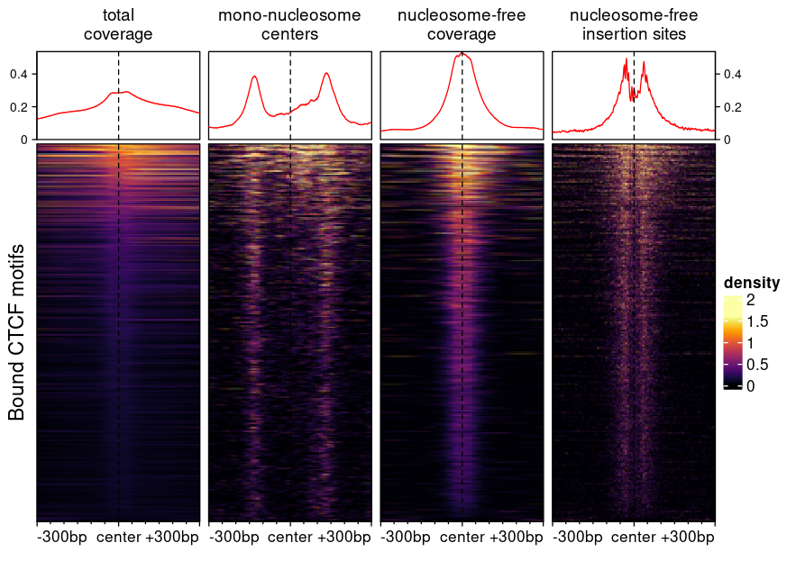

# epiwraps: smooth epigenomics data analysis and visualization with Bioconductor

## Introduction

The `epiwraps` package started off as a set of wrappers for the visualization of
epigenomics data (in particular ATAC/ChIP-seq), meant to facilitate the teaching
of regulatory genomics through hands-on exploration of such data. It has now 
evolved into a set of tools around this task, including missing R-based 
alternatives for some important steps.

**Note that the package and documentation are both still under heavy development!**

### Installation

Install with:

```r
BiocManager::install("ETHZ-INS/epiwraps")
```

Key topics:

* [Plotting signals in a region](#plotting-signals-in-a-region)
* [Plotting signals in many regions](#plotting-signals-in-many-regions)
* [Bigwig file generation](#bigwig-file-generation)
* [Peak calling](#peak-calling)

<br/><br/>

## Visualization

Bioconductor offers power packages for the analysis and visualization of 
(epi)genomic data, however they are often not always easy to approach for users 
without an extensive bioinformatics background. The `epiwraps` provide simpler 
entry-points to such tasks via a simple and unified interface to the more 
powerful capabilities of other packages.


### Plotting signals in a region

The `plotSignalTracks` function is a wrapper around the 
*[Gviz](https://bioconductor.org/packages/3.13/Gviz)* package, which plots one 
or more signals along genomic coordinates (in a genome-browser like fashion). 
The function lacks the full flexibility of the *[Gviz](https://bioconductor.org/packages/3.13/Gviz)* 
package (although considerable customization is possible), but presents a 
considerable simpler interface, with automatic default parameters, etc. It has 
two essential arguments: a (named) list of files (or objects) whose 
signal to display (can be a mixture of bigwig, bam, or bed-like files, or 
GRanges), and the region in which to display the signals (can be given as a 
GRanges or as a string). The function then automatically determines the 
relevant track type and setting from the file types.


```r
library(GenomicRanges)
library(epiwraps)
# get the path to an example bigwig file:
bwf1 <- system.file("extdata/example_rna.bw", package="epiwraps")
plotSignalTracks(list(RNA=bwf1), region="8:22165140-22212326", genomeAxis=TRUE)
```

<!-- -->

```r
# we could plot multiple tracks as follows:
plotSignalTracks(list(track1=bwf1, track2=bwf1), region="8:22165140-22212326")
```

<!-- -->

`GRanges` objects can also be plotted as annotation tracks alongside other data:


```r
myregions=GRanges("8", IRanges(c(22166000,22202300), width=3000))
plotSignalTracks(list(RNA=bwf1, regions=myregions), region="8:22165140-22212326")
```

<!-- -->

Colors, track display types, and such parameters can either be set for all tracks
or for each individual track, for example:


```r
myregions <- GRanges("8", IRanges(c(22166000,22202300), width=3000))
plotSignalTracks(list(RNA=bwf1, regions=myregions), colors=c("red", "black"),
                 region="8:22165140-22212326")
```

<!-- -->


For bam files, we can also plot individual reads:

```r
# we fetch an example bam file:
bam <- system.file("extdata", "ex1.bam", package="Rsamtools")
plotSignalTracks(c("my bam file"=bam), "seq1:1-1500", type="alignments")
```

<!-- -->

#### Merging signal from different tracks

In addition to being displayed one below the other, data tracks can be combined
in different ways. To do this, the tracks can simply be given in a nested 
fashion:


```r
plotSignalTracks(list(track1=bwf1, combined=c(bwf1,bwf1)),
                 region="8:22165140-22212326")
```

In this example we are always using the same track, but the first element 
('track1') plots the track alone, while the second ('combined') merges the two 
given tracks. By default, the mean is shown, but this can be controlled through 
the `aggregation` argument. In addition to usual operations, the tracks can be 
overlayed on top of one another (`aggregation='overlay'`), or shown as a 
heatmap (`aggregation='heatmap'`).

#### Using an EnsDb object

If an `EnsDb` object is available (see the *[ensembldb](https://bioconductor.org/packages/3.13/ensembldb)* 
package for a description of the class and its methods, and the 
*[AnnotationHub](https://bioconductor.org/packages/3.13/AnnotationHub)* package for a convenient way of 
fetching such annotation objects), two additional options are available: first,
instead of specifying the region as coordinates, one can specify a gene or 
transcript name, and the corresponding region will be fetched. In addition, the
genes or transcripts can be displayed. For example:


```r
# we fetch the GRCh38 Ensembl 103 annotation (this is not run in the vignette,
# as it takes some time to download the annotation the first time is used):
library(AnnotationHub)
ah <- AnnotationHub()
ensdb <- ah[["AH89426"]]
# we plot our previous RNA bigwig file, around the BMP1 locus:
plotSignalTracks(c(coverage=bwf1), region="BMP1", ensdb=ensdb, 
                 transcripts="full")
```


Now we can see that the coverage is nicely restricted to exons, and that some 
transcripts/exons are not expressed as highly as others. The transcripts could 
also have been collapsed into a gene model using `transcripts="collapsed"` (the
default).

To display only the gene track, the first argument can simply be omitted.

#### Further track customization

In addition to the `colors` and `type` argument (and a number of others), which 
can customize the appearance of tracks, any additional parameters supported by 
the respective *[Gviz](https://bioconductor.org/packages/3.13/Gviz)* function 
can be passed through the `genes.params` (for Gviz's `GeneRegionTrack`), 
`align.params` (for Gviz's `AlignmentsTrack`, when plotting individual reads), 
or `tracks.params` (for any other Gviz `DataTrack`).

Also, in addition to passing filepaths or `GRanges`, any Gviz track(s) can be 
passed (i.e. objects inheriting the `GdObject` class) can be passed, enabling 
full track customization when needed.

<br/><br/>

### Plotting signals in many regions

Most of the functions described in this section are wrappers around the 
*[EnrichedHeatmap](https://bioconductor.org/packages/3.13/EnrichedHeatmap)* package, which plots genomic signal 
around many regions using heatmaps. The interface here has been simplified, but
for full functionalities and customization it is recommended to have a look at 
the *[EnrichedHeatmap](https://bioconductor.org/packages/3.13/EnrichedHeatmap)* documentation.

Since reading signal across many regions can take some time, the interface has
been split into two step: reading the data matrix, and plotting.

#### Reading signal around a set of regions

The `signal2Matrix` function reads genomic signals around the centers of a set
of regions (or alternatively scaling a set of regions to the same size). It can 
read from bam and BigWig files, although reading from bam files is considerably 
slower. We can showcase it using the previous toy ATAC bigwig file:


```r
# we fetch the path to the example bigwig file:
bwf <- system.file("extdata/example_atac.bw", package="epiwraps")
# we load example regions (could be a GRanges or a path to a bed-like file):
regions <- system.file("extdata/example_peaks.bed", package="epiwraps")
# we obtain the matrix of the signal around the regions. For the purpose of this
# example, we'll read twice from the same:
m <- signal2Matrix(c(atac1=bwf, atac2=bwf), regions, extend=1000)
```

```r
lapply(m,dim)
```

```
## $atac1
## [1] 264 200
## 
## $atac2
## [1] 264 200
```

The result is a named list of matrices (more specifically, `normalizedMatrix`
objects, see *[EnrichedHeatmap](https://bioconductor.org/packages/3.13/EnrichedHeatmap)*) with equal dimensions. 
In this example, the matrix has 264 rows/regions, and 200 columns because we
asked to extend 1000bp on either side, and the default bin size is 10bp.

In addition to the arguments explicitly described in the function's help, it
can accept a number of arguments also accepted by the `normalizeToMatrix` 
function (e.g. `smooth=TRUE`). 

When reading multiple files, the `BPPARAM` argument can be used to set 
multi-threading and increase speed.

#### Manipulating signal matrices

The list of signal matrices can be manipulated as any list of matrices, for 
instance using subsetting (e.g. `m[1:2]`), but even using transformations, e.g.:


```r
# square-root transform
m2 <- lapply(m, sqrt)
```

For re-normalizing lists of signal matrices, see `?rescaleSignalMatrices` and/or
`?renormalizeBorders`. In addition, signal matrices can be combined either 
manually, or using the following convenience function:


```r
merged <- mergeSignalMatrices(m, aggregation="mean")
```


#### Plotting heatmaps

Once the matrices have been created, we can plot heatmaps based on them as 
follows:


```r
plotEnrichedHeatmaps(m)
```

<!-- -->

```r
# we  can use most arguments that are supported by EnrichedHeatmap, e.g.:
plotEnrichedHeatmaps(m, colors=c("white","darkred"), cluster_rows=TRUE,
                     show_row_dend=TRUE, top_annotation=FALSE, 
                     row_title="My list of cool regions")
```

<!-- -->

By default, the colorscale is trimmed to prevent most of it being driven by rare
extreme values. This can be controlled via the `trim` argument (which indicates
up to which quantile of data points to keep to establish the colorscale). 
Compare for instance the following two heatmaps:


```r
plotEnrichedHeatmaps(list("trim=1"=m[[1]]), trim=1, scale_title="trim=1",
                     top_annotation=FALSE) +
  plotEnrichedHeatmaps(list("trim=0.99"=m[[1]]), trim=0.99, scale_title="trim=0.99",
                     top_annotation=FALSE) +
  plotEnrichedHeatmaps(list("trim=0.9"=m[[1]]), trim=0.9, 
                       scale_title="trim=0.9", top_annotation=FALSE)
```

<!-- -->

The underlying data is exactly the same, only the color-mapping changes. In the 
left one, which has no trimming, a single very high value at the top forces the
colorscale to extend to high values, even though most of the data is in the 
very low range, resulting in a very dark heatmap. In the one on the right, it's
the opposite: so much is trimmed that many points reach the top of the 
colorscale, resulting in a an 'over-exposed' heatmap. In practice, it is 
advisable to use minimal trimming (e.g. the default is `c(0.01,0.99)`,
as in the corresponding DeepTools function).

<br/><br/>

#### Plotting aggregated signals

It is also possible to plot only the average signals across regions. To do this,
we first melt the signal matrices and then use 
*[ggplot2](https://CRAN.R-project.org/package=ggplot2)*. The
`meltSignals` function will return a data.frame showing the mean, standard 
deviation, standard error and median at each position relative to the center,
for each sample/matrix:


```r
d <- meltSignals(m)
head(d)
```

```
##   position sample       mean         SD          SE     median
## 1    -1000  atac1 0.05497661 0.04381686 0.002696741 0.04595237
## 2     -990  atac1 0.05578699 0.04714077 0.002901314 0.04888547
## 3     -980  atac1 0.05548330 0.04692492 0.002888029 0.04470801
## 4     -970  atac1 0.05568262 0.04745326 0.002920547 0.04497465
## 5     -960  atac1 0.05592874 0.04809529 0.002960061 0.03910840
## 6     -950  atac1 0.05677649 0.04775387 0.002939048 0.04741890
```

This can then be used for plotting, e.g.:


```r
library(ggplot2)
ggplot(d, aes(position, mean, colour=sample)) + 
  geom_vline(xintercept=0, linetype="dashed") + geom_line(lwd=2)
```

<!-- -->

<br/><br/>

## Bigwig file generation

The `bam2bw` function enables the creation of coverage bigwig files from `.bam`
files, with a variety of options. It uses efficient Rle-based tiling for lower
than single-bp resolution, and offers a wide variety of options, exemplified in
the following figure:



All columns are based on the same bam file, but select and/or summarize 
fragments differently. For example, the heatmap of insertion sites of 
nucleosome-free fragments was based on a bigwig file generated using:

```r
bam2bw("aligned.bam", output_bw="NF_cuts.bw", paired=TRUE, `shift=c(4L,-5L), 
       binWidth=1L, minFragLength=25, maxFragLength=120, type="ends"`)
```

The arguments specify that only the beginning and end of the 
fragments (`type="ends"`) of length 25-120 (`minFragLength` and `maxFragLength`)
should be used to compute per-bp (`binWidth=1`) coverage. Shifts are applied to
fragments to get to the actual site where the transposase sits.

Bigwig files can also be generated as an enrichment over an input, allowing the 
use of local neighborhood backgrounds (MACS-like). For more detail, see the 
`bam2bw` vignette.

<br/><br/>

## Peak calling

The `callPeaks` function offers a R-based implementation of the general strategy
used by MACS2 (Zhang et al., Genome Biology 2008). The function is still under
heavy development, especially with respect to single-end reads, and its usage is
not currently recommended.
Key differences with respect to MACS are that: 1) the p-values are more 
conservative (and arguably more calibrated) and 2) because the implementation 
does not rely on sliding windows, with default settings the peaks are narrower.

Although still experimental, the function can be used as follows:

```r
peaks <- callPeaks("aligned.bam", "input.bam", paired=TRUE,
                   blacklist="/path/to/blacklist.bed", outFormat="narrowPeak")
```

Using the blacklist during peak calling (if the regions have not already been 
filtered out of the bam files) is recommended because it will have a major 
impact on the negative peaks identified in the input/control, and as a result
on the empirical FDR.

`callPeaks` takes about twice as long to run as MACS2, and uses more memory. If
dealing with very large files (or a very low memory system), consider
increasing the number of processing chunks, for instance with `nChunks=10`.

<br/><br/>

## Misc

The package furthermore includes a variety of utility functions, for instance 
providing quality controls and the likes.
  
See the package's vignettes for more information.
