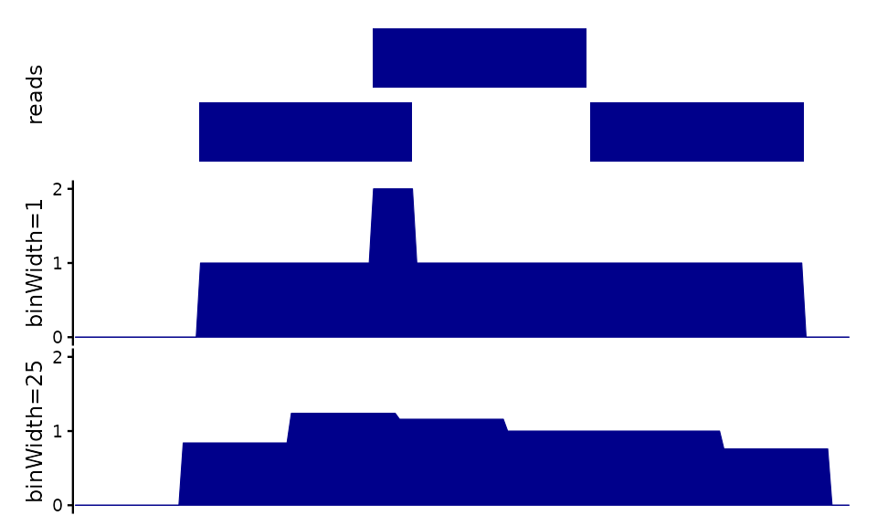
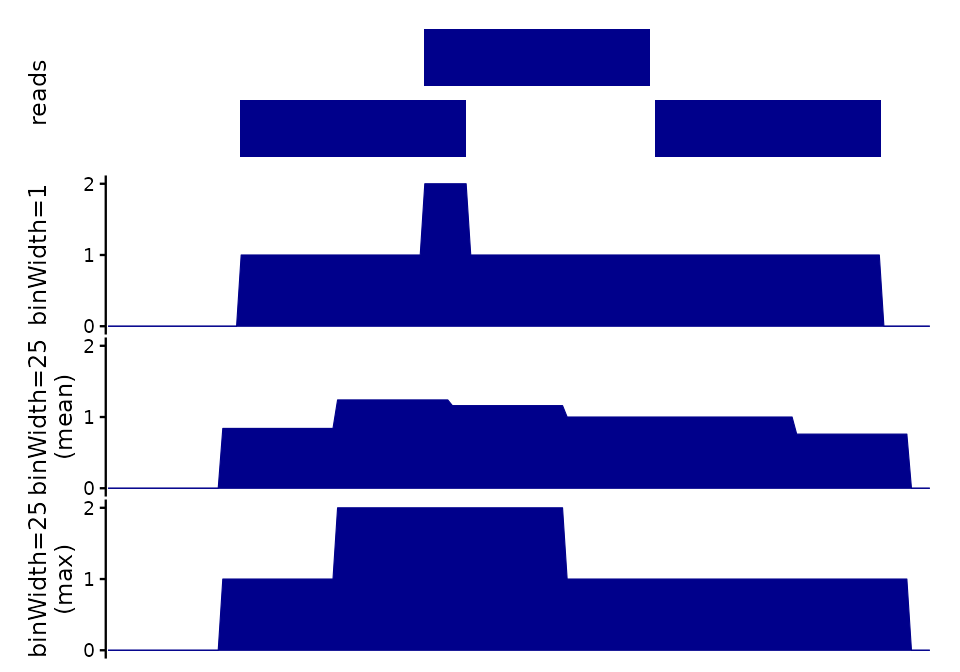
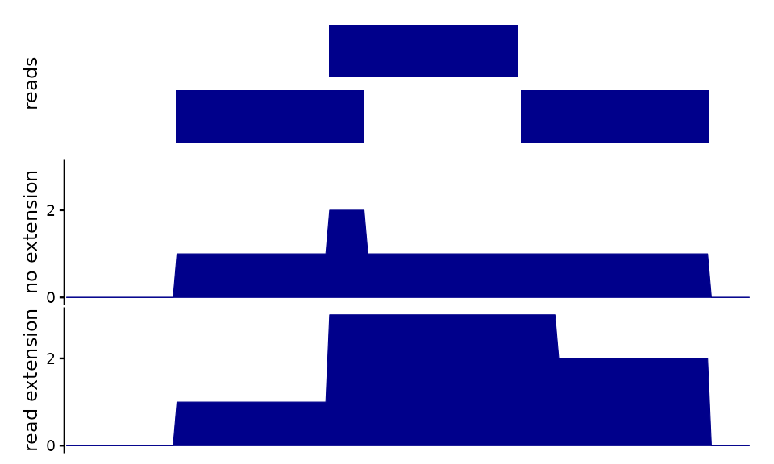
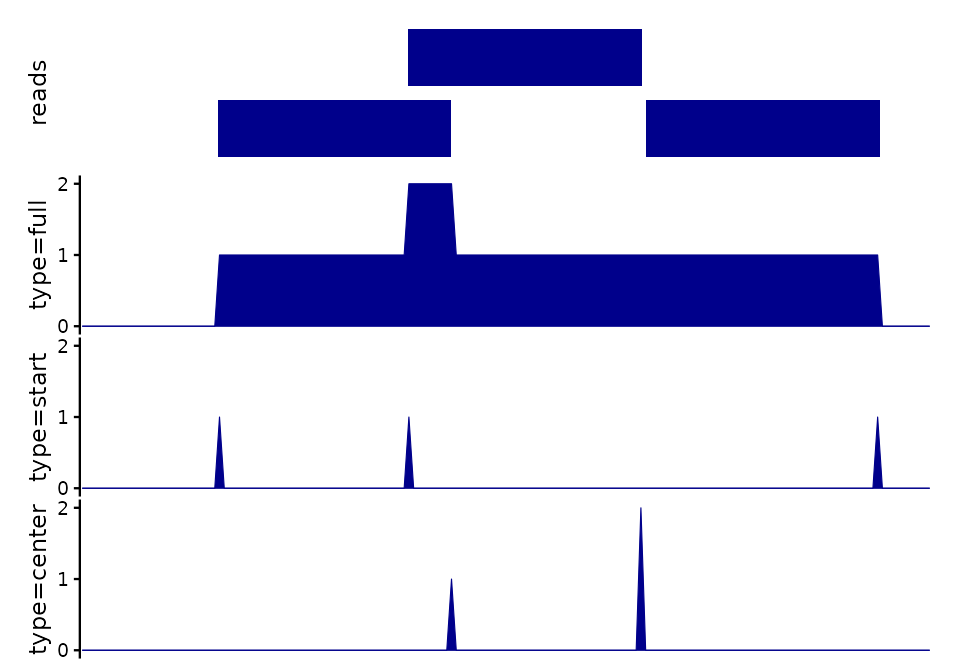
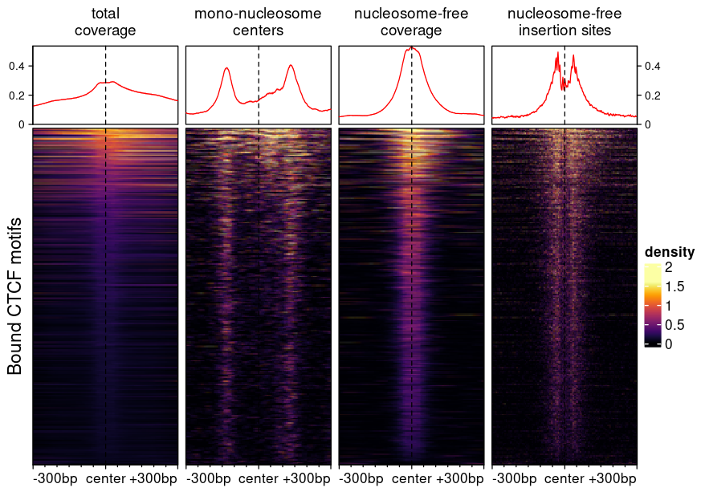

# Generating bigwig tracks with bam2bw

Abstract

This vignette documents the use of the ‘bam2bw’ function of the epiwraps
package, which generates bigwig tracks from alignment files in an
efficient and flexible fashion.

## Introduction

The `bam2bw` function can be used to compute per-nucleotide or per-bin
coverage from alignments and save it to a bigwig file. In this process,
information about individual reads is lost, but the produced signals are
considerably more lightweight and amenable to visualization. The bigwig
format is readily queried from R or compatible with a variety of tools,
including genome browsers.

  

### Many ways of compiling coverage

To introduce the different variations on coverage, let’s assume you’ve
go the following single-end reads:

``` r
suppressPackageStartupMessages({
  library(epiwraps)
  library(patchwork) # to combine the signal plots
})
# we create some arbitrary genomic ranges
gr <- GRanges("chr1", IRanges(c(30,70,120), width=50), strand=c("+","+","-"),
              seqlengths=c(chr1=500))
ggSignalTracks(list(reads=gr), region="chr1:1:180", xAxis = FALSE)[[1]]
```


For testing purposes, we’ll save this as a bam file and index it:

``` r
bam <- tempfile(fileext = ".bam") # temp file name
rtracklayer::export(gr, bam, format="bam")
Rsamtools::indexBam(bam)
```

    ##       /tmp/RtmpNOYoi7/file1e32163db198.bam 
    ## "/tmp/RtmpNOYoi7/file1e32163db198.bam.bai"

Using these example reads, we can illustrate different ways of computing
coverages.

First, we can save coverage at different resolutions, from full
resolution (each nucleotide is a single bin) to larger bin sizes, the
latter giving smaller filesizes:

``` r
# Full coverage with bin width of 1 nucleotide (i.e. full resolution)
cov_full_bw1 <- tempfile(fileext = ".bw") # temp file name
bam2bw(bam, cov_full_bw1, binWidth=1L, scaling=FALSE)
```

    ## `paired` not specified, assuming single-end reads. Set to paired='auto' to automatically detect.

    ## Reading in signal...

    ## Writing bigwig...

``` r
# Full coverage with larger bins
cov_full_bw25 <- tempfile(fileext = ".bw")
bam2bw(bam, cov_full_bw25, binWidth=25L, scaling=FALSE)
```

    ## `paired` not specified, assuming single-end reads. Set to paired='auto' to automatically detect.

    ## Reading in signal...

    ## Writing bigwig...

``` r
pl <- ggSignalTracks(list(reads=gr, "binWidth=1"=cov_full_bw1,
                          "binWidth=25"=cov_full_bw25),
                     region="chr1:1:180", xAxis = FALSE)
wrap_plots(pl, ncol=1)
```



Both tracks compile the number of reads that overlap each position, but
in the bottom track the signal is by chunks of 25 nucleotides. By
default, the maximum signal inside a bin is used, however it is possible
to change this:

``` r
# Using mean per bin:
cov_full_bw25max <- tempfile(fileext = ".bw")
bam2bw(bam, cov_full_bw25max, binWidth=25L, binSummarization = "max", scaling=FALSE)
```

    ## `paired` not specified, assuming single-end reads. Set to paired='auto' to automatically detect.

    ## Reading in signal...

    ## Writing bigwig...

``` r
pl <- ggSignalTracks(list(reads=gr, "binWidth=1"=cov_full_bw1, 
                          "binWidth=25\n(mean)"=cov_full_bw25,
                          "binWidth=25\n(max)"=cov_full_bw25max),
                     region="chr1:1:180", xAxis=FALSE)
wrap_plots(pl, ncol=1)
```



In most cases, single-end reads are just the beginning of the DNA
fragments obtained, and we know the average size of the fragments from
library prep QC (if not, see the `estimateFragSize` function, or the
simpler `estimate.mean.fraglen` function of the
*[chipseq](https://bioconductor.org/packages/3.23/chipseq)* package). It
is therefore common to extend reads to this size when computing
coverage, so as to obtain the number of fragments (rather than reads)
coverage each position. This can be done as follows:

``` r
# Here the reads are 50bp, and we want to extend them to 100bp, hence _by_ 50:
cov_full_ext <- tempfile(fileext = ".bw")
bam2bw(bam, cov_full_ext, binWidth=1L, extend=50L, scaling=FALSE)
```

    ## `paired` not specified, assuming single-end reads. Set to paired='auto' to automatically detect.

    ## Reading in signal...

    ## Writing bigwig...

``` r
pl <- ggSignalTracks(list(reads=gr, "no extension"=cov_full_bw1, 
                          "read extension"=cov_full_ext),
                     region="chr1:1:180", xAxis=FALSE)
wrap_plots(pl, ncol=1)
```



Taking into account read extension shows better the peak at the center,
which is indicative of the fact that this is the region that was the
most enriched in the captured fragments.

Instead of computing coverage, we could compute the number of reads
starting, ending, or being centered at each position:

``` r
# Here the reads are 50bp, and we want to extend them to 100bp, hence _by_ 50:
cov_start <- tempfile(fileext = ".bw")
bam2bw(bam, cov_start, binWidth=1L, extend=50L, scaling=FALSE, type="start")
```

    ## `paired` not specified, assuming single-end reads. Set to paired='auto' to automatically detect.

    ## Reading in signal...

    ## Writing bigwig...

``` r
cov_center <- tempfile(fileext = ".bw")
bam2bw(bam, cov_center, binWidth=1L, extend=50L, scaling=FALSE, type="center")
```

    ## `paired` not specified, assuming single-end reads. Set to paired='auto' to automatically detect.

    ## Reading in signal...

    ## Writing bigwig...

``` r
pl <- ggSignalTracks(list(reads=gr, "type=full"=cov_full_bw1, 
                          "type=start"=cov_start, "type=center"=cov_center),
                     region="chr1:1:180", xAxis=FALSE)
wrap_plots(pl, ncol=1)
```



Note that when extending reads, as in this case, the position
(e.g. “center”) are relative to the extended read (i.e. extension is
applied first).

  

### Example heatmaps created using different bigwig generation procedures

The following figure, created using `epiwraps` (see [the vignette on
generating such
plots](https://ethz-ins.github.io/epiwraps/articles/multiRegionPlot.md)),
represent chromatin accessibility (ATAC-seq) signals around bound CTCF
motifs in T-cells. The different signals are based on different bigwig
files derived from the same bam file using the functions described
above.



- The first heatmap (‘full coverage’) was generated with default
  parameter, and is the fragment coverage (i.e. how many fragments
  overlap any given location).
- The second heatmap shows the fragment of sizes compatible with
  mono-nucleosomes, resizing fragments from their centers. The exact
  arguments used were
  `minFragLength=147, maxFragLength=230, type="center", extend=25L`.
  Using this we can see nucleosomes well-positioned at some distance
  from CTCF binding sites, but a relative depletion of nucleosomes at
  the bound site itself.
- The third shows the coverage of nucleosome-free fragments, in this
  case it was used with `maxFragLength=120`. These are indicative of TF
  binding, and indeed we only see and enrichment in the center.
- The fourth shows where the transposase inserted itself, and was
  generated with `trim=4L, binWidth=1L, maxFragLength=120, type="ends"`.
  Using this we can see a nice footprint protected from the transposase
  by CTCF binding.

For more information about these parameters, see
[`?bam2bw`](https://ethz-ins.github.io/epiwraps/reference/bam2bw.md).

ATAC fragment sizes convey rich information, but they are not perfect.
For example, regions of DNA bound by multiple TFs can sometimes be
captured as longer fragments which we would mistakenly classify as
mono-nucleosome containing.

  

## Working with fragment files as an input

If you use fragment files (preferably tabix-indexed) rather than bam
files as input, you can still perform most of the above tasks. See the
[`?frag2bw`](https://ethz-ins.github.io/epiwraps/reference/frag2bw.md)
function for more information.

  
  

## Session information

``` r
sessionInfo()
```

    ## R version 4.6.1 (2026-06-24)
    ## Platform: x86_64-pc-linux-gnu
    ## Running under: Ubuntu 24.04.4 LTS
    ## 
    ## Matrix products: default
    ## BLAS:   /usr/lib/x86_64-linux-gnu/openblas-pthread/libblas.so.3 
    ## LAPACK: /usr/lib/x86_64-linux-gnu/openblas-pthread/libopenblasp-r0.3.26.so;  LAPACK version 3.12.0
    ## 
    ## locale:
    ##  [1] LC_CTYPE=C.UTF-8       LC_NUMERIC=C           LC_TIME=C.UTF-8       
    ##  [4] LC_COLLATE=C.UTF-8     LC_MONETARY=C.UTF-8    LC_MESSAGES=C.UTF-8   
    ##  [7] LC_PAPER=C.UTF-8       LC_NAME=C              LC_ADDRESS=C          
    ## [10] LC_TELEPHONE=C         LC_MEASUREMENT=C.UTF-8 LC_IDENTIFICATION=C   
    ## 
    ## time zone: UTC
    ## tzcode source: system (glibc)
    ## 
    ## attached base packages:
    ## [1] grid      stats4    stats     graphics  grDevices utils     datasets 
    ## [8] methods   base     
    ## 
    ## other attached packages:
    ##  [1] patchwork_1.3.2             epiwraps_0.99.125          
    ##  [3] EnrichedHeatmap_1.42.0      ComplexHeatmap_2.28.0      
    ##  [5] SummarizedExperiment_1.42.0 Biobase_2.72.0             
    ##  [7] GenomicRanges_1.64.0        Seqinfo_1.2.0              
    ##  [9] IRanges_2.46.0              S4Vectors_0.50.1           
    ## [11] BiocGenerics_0.58.1         generics_0.1.4             
    ## [13] MatrixGenerics_1.24.0       matrixStats_1.5.0          
    ## [15] BiocStyle_2.40.0           
    ## 
    ## loaded via a namespace (and not attached):
    ##   [1] DBI_1.3.0                bitops_1.0-9             pbapply_1.7-4           
    ##   [4] rlang_1.3.0              magrittr_2.0.5           clue_0.3-68             
    ##   [7] GetoptLong_1.1.1         otel_0.2.0               compiler_4.6.1          
    ##  [10] RSQLite_3.53.3           GenomicFeatures_1.64.0   png_0.1-9               
    ##  [13] systemfonts_1.3.2        vctrs_0.7.3              ProtGenerics_1.44.0     
    ##  [16] pkgconfig_2.0.3          shape_1.4.6.1            crayon_1.5.3            
    ##  [19] fastmap_1.2.0            XVector_0.52.0           labeling_0.4.3          
    ##  [22] Rsamtools_2.28.0         rmarkdown_2.31           UCSC.utils_1.8.0        
    ##  [25] ragg_1.5.2               bit_4.6.0                xfun_0.60               
    ##  [28] cachem_1.1.0             cigarillo_1.2.0          GenomeInfoDb_1.48.0     
    ##  [31] jsonlite_2.0.0           blob_1.3.0               DelayedArray_0.38.2     
    ##  [34] BiocParallel_1.46.0      parallel_4.6.1           cluster_2.1.8.2         
    ##  [37] VariantAnnotation_1.58.0 R6_2.6.1                 bslib_0.11.0            
    ##  [40] RColorBrewer_1.1-3       rtracklayer_1.72.0       jquerylib_0.1.4         
    ##  [43] Rcpp_1.1.2               bookdown_0.47            iterators_1.0.14        
    ##  [46] knitr_1.51               Matrix_1.7-5             tidyselect_1.2.1        
    ##  [49] dichromat_2.0-0.1        abind_1.4-8              yaml_2.3.12             
    ##  [52] doParallel_1.0.17        codetools_0.2-20         curl_7.1.0              
    ##  [55] lattice_0.22-9           tibble_3.3.1             withr_3.0.3             
    ##  [58] KEGGREST_1.52.2          S7_0.2.2                 evaluate_1.0.5          
    ##  [61] desc_1.4.3               circlize_0.4.18          Biostrings_2.80.1       
    ##  [64] pillar_1.11.1            BiocManager_1.30.27      foreach_1.5.2           
    ##  [67] RCurl_1.98-1.19          ensembldb_2.36.1         ggplot2_4.0.3           
    ##  [70] scales_1.4.0             GenomicFiles_1.48.0      glue_1.8.1              
    ##  [73] lazyeval_0.2.3           tools_4.6.1              BiocIO_1.22.0           
    ##  [76] data.table_1.18.4        BSgenome_1.80.0          locfit_1.5-9.12         
    ##  [79] GenomicAlignments_1.48.0 XML_3.99-0.23            fs_2.1.0                
    ##  [82] AnnotationDbi_1.74.0     colorspace_2.1-2         restfulr_0.0.17         
    ##  [85] cli_3.6.6                textshaping_1.0.5        viridisLite_0.4.3       
    ##  [88] S4Arrays_1.12.0          dplyr_1.2.1              AnnotationFilter_1.36.0 
    ##  [91] gtable_0.3.6             sass_0.4.10              digest_0.6.39           
    ##  [94] SparseArray_1.12.2       rjson_0.2.23             htmlwidgets_1.6.4       
    ##  [97] farver_2.1.2             memoise_2.0.1            htmltools_0.5.9         
    ## [100] pkgdown_2.2.1            lifecycle_1.0.5          httr_1.4.8              
    ## [103] GlobalOptions_0.1.4      bit64_4.8.2
