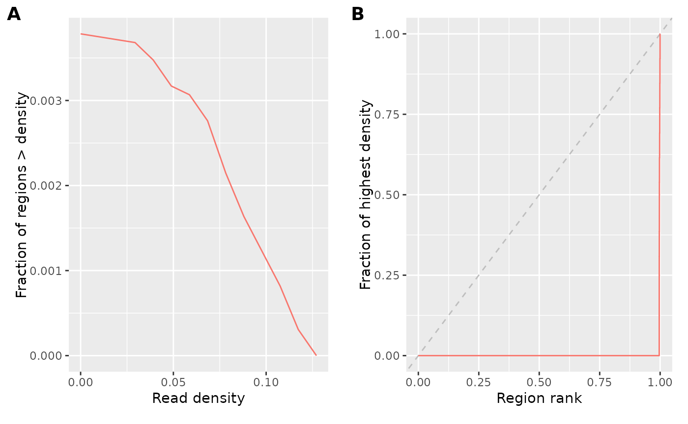

# Miscellaneous epiwraps functions

Abstract

This vignette introduces some more isolated epiwraps functions.

## Getting read counts in regions of interest

The `peakCountsFromBAM` and `peakCountsFromFrags` functions enable the
construction of SummarizedExperiment objects containing overlap counts
of regions across samples. `peakCountsFromFrags` is especially geared
towards single-cell data, splitting the frag file by cell barcodes,
generating sparse representations and optionally doing pseudo-bulk
aggregation on the fly.

The functions can also compute fragment length information for each
region, which can for instance be used with the `betterChromVAR`
package. For example:

``` r

suppressPackageStartupMessages(library(epiwraps))
bam <- system.file("extdata", "ex1.bam", package="Rsamtools")
# create regions of interest
peaks <- GRanges(c("seq1","seq1","seq2"), IRanges(c(400,900,500), width=100))
peakCountsFromBAM(bam, peaks, paired=FALSE, getMedianFragLength=TRUE)
```

    ## class: RangedSummarizedExperiment 
    ## dim: 3 1 
    ## metadata(0):
    ## assays(1): counts
    ## rownames(3): seq1:400-499 seq1:900-999 seq2:500-599
    ## rowData names(1): flbias
    ## colnames(1): ex1
    ## colData names(2): total_depth depth

## Quality control

### Coverage statistics

Coverage statistics give an overview of how the reads are distributed
across the genome (or more precisely, across a large number of random
regions). The `getCovStats` will compute such statistics from bam or
bigwig files (from bigwig files will be considerably faster, but if the
files are normalized the coverage/density will be relative).

Because our example data spans only part of a chromosome, we’ll exclude
completely empty regions using the `exclude` parameter, which would
normally be used to exclude regions likely to be technical artefacts
(e.g. blacklisted regions).

``` r

# get the path to an example bigwig file:
bwf <- system.file("extdata/example_atac.bw", package="epiwraps")
cs <- getCovStats(bwf, exclude=GRanges("1", IRanges(1, 4300000)))
plotCovStats(cs)
```



Panel A shows the proportion of sampled regions which are above a
certain read density (relative because this is a normalized bigwig file,
would be coverage otherwise). This shows us, for example, that as
expected only a minority of regions have any reads at all (indicating
that the reads are not randomly distributed). Panel B is what is
sometimes called a fingerprint plot. It similarly shows us that the
reads are concentrated in very few regions, since the vast majority of
regions have only a very low fraction of the coverage of a few
high-density regions. Randomly distributed reads would go along the
diagonal, but one normally has a curve somewhere between this line and
the lower-right corner – the farther away from the diagonal, to more
strongly enriched the data is.

This can be done for multiple files simultaneously. If we have several
files, we can also use the coverage in the random windows to computer
their similarity (see
[`?plotCorFromCovStats`](https://ethz-ins.github.io/epiwraps/reference/plotCorFromCovStats.md)).

### Fragment length distributions

Given one or more paired-end bam files, we can extract and plot the
fragment length distribution using:

``` r

fragSizesDist(bam, what=100)
```

### TSS enrichment

The TSS enrichment can also be calculated and plotted using the
`TSSenrichment` function.

## Peak calling

A peak calling function can be used, either against an input control or
against local or global backgrounds:

``` r

p <- callPeaks(bam)
```

Note that the peak caller was developed chiefly to facilitate teaching,
and we do not guarantee its performance.

## Region merging

The merging of genomic regions with `reduce` tends to produce large
regions which are undesirable for some downstream analyses. As an
alternative, the `reduceWithResplit` function splits large merges using
local overlap minima.

## Region overlapping

The `GenomicRanges` package offers fast and powerful functions for
overlapping genomic regions. `epiwraps` includes wrappers around those
for common tasks, such as calculating and visualizing overlaps across
multiple sets of regions (see
[`?regionsToUpset`](https://ethz-ins.github.io/epiwraps/reference/regionsToUpset.md),
[`?regionOverlaps`](https://ethz-ins.github.io/epiwraps/reference/regionOverlaps.md),
and
[`?regionCAT`](https://ethz-ins.github.io/epiwraps/reference/regionCAT.md)).

  
  

## Session information

``` r

sessionInfo()
```

    ## R version 4.6.0 (2026-04-24)
    ## Platform: x86_64-pc-linux-gnu
    ## Running under: Ubuntu 24.04.4 LTS
    ## 
    ## Matrix products: default
    ## BLAS:   /usr/lib/x86_64-linux-gnu/openblas-pthread/libblas.so.3 
    ## LAPACK: /usr/lib/x86_64-linux-gnu/openblas-pthread/libopenblasp-r0.3.26.so;  LAPACK version 3.12.0
    ## 
    ## locale:
    ##  [1] LC_CTYPE=C.UTF-8       LC_NUMERIC=C           LC_TIME=C.UTF-8       
    ##  [4] LC_COLLATE=C.UTF-8     LC_MONETARY=C.UTF-8    LC_MESSAGES=C.UTF-8   
    ##  [7] LC_PAPER=C.UTF-8       LC_NAME=C              LC_ADDRESS=C          
    ## [10] LC_TELEPHONE=C         LC_MEASUREMENT=C.UTF-8 LC_IDENTIFICATION=C   
    ## 
    ## time zone: UTC
    ## tzcode source: system (glibc)
    ## 
    ## attached base packages:
    ## [1] grid      stats4    stats     graphics  grDevices utils     datasets 
    ## [8] methods   base     
    ## 
    ## other attached packages:
    ##  [1] epiwraps_0.99.115           EnrichedHeatmap_1.42.0     
    ##  [3] ComplexHeatmap_2.28.0       SummarizedExperiment_1.42.0
    ##  [5] Biobase_2.72.0              GenomicRanges_1.64.0       
    ##  [7] Seqinfo_1.2.0               IRanges_2.46.0             
    ##  [9] S4Vectors_0.50.0            BiocGenerics_0.58.0        
    ## [11] generics_0.1.4              MatrixGenerics_1.24.0      
    ## [13] matrixStats_1.5.0           BiocStyle_2.40.0           
    ## 
    ## loaded via a namespace (and not attached):
    ##   [1] RColorBrewer_1.1-3       rstudioapi_0.18.0        jsonlite_2.0.0          
    ##   [4] shape_1.4.6.1            magrittr_2.0.5           GenomicFeatures_1.64.0  
    ##   [7] farver_2.1.2             rmarkdown_2.31           GlobalOptions_0.1.4     
    ##  [10] fs_2.1.0                 BiocIO_1.22.0            ragg_1.5.2              
    ##  [13] vctrs_0.7.3              memoise_2.0.1            Rsamtools_2.28.0        
    ##  [16] RCurl_1.98-1.18          base64enc_0.1-6          htmltools_0.5.9         
    ##  [19] S4Arrays_1.12.0          progress_1.2.3           curl_7.1.0              
    ##  [22] SparseArray_1.12.2       Formula_1.2-5            sass_0.4.10             
    ##  [25] bslib_0.10.0             htmlwidgets_1.6.4        desc_1.4.3              
    ##  [28] Gviz_1.56.0              httr2_1.2.2              cachem_1.1.0            
    ##  [31] GenomicAlignments_1.48.0 lifecycle_1.0.5          iterators_1.0.14        
    ##  [34] pkgconfig_2.0.3          Matrix_1.7-5             R6_2.6.1                
    ##  [37] fastmap_1.2.0            clue_0.3-68              digest_0.6.39           
    ##  [40] colorspace_2.1-2         AnnotationDbi_1.74.0     textshaping_1.0.5       
    ##  [43] Hmisc_5.2-5              RSQLite_2.4.6            labeling_0.4.3          
    ##  [46] filelock_1.0.3           httr_1.4.8               abind_1.4-8             
    ##  [49] compiler_4.6.0           withr_3.0.2              bit64_4.8.0             
    ##  [52] doParallel_1.0.17        backports_1.5.1          htmlTable_2.5.0         
    ##  [55] S7_0.2.2                 BiocParallel_1.46.0      DBI_1.3.0               
    ##  [58] biomaRt_2.68.0           rappdirs_0.3.4           DelayedArray_0.38.1     
    ##  [61] rjson_0.2.23             tools_4.6.0              foreign_0.8-91          
    ##  [64] nnet_7.3-20              glue_1.8.1               restfulr_0.0.16         
    ##  [67] checkmate_2.3.4          cluster_2.1.8.2          gtable_0.3.6            
    ##  [70] BSgenome_1.80.0          ensembldb_2.36.0         data.table_1.18.2.1     
    ##  [73] hms_1.1.4                XVector_0.52.0           foreach_1.5.2           
    ##  [76] pillar_1.11.1            stringr_1.6.0            circlize_0.4.18         
    ##  [79] dplyr_1.2.1              BiocFileCache_3.2.0      lattice_0.22-9          
    ##  [82] deldir_2.0-4             rtracklayer_1.72.0       bit_4.6.0               
    ##  [85] biovizBase_1.60.0        tidyselect_1.2.1         locfit_1.5-9.12         
    ##  [88] pbapply_1.7-4            Biostrings_2.80.0        knitr_1.51              
    ##  [91] gridExtra_2.3            bookdown_0.46            ProtGenerics_1.44.0     
    ##  [94] xfun_0.57                stringi_1.8.7            UCSC.utils_1.8.0        
    ##  [97] lazyeval_0.2.3           yaml_2.3.12              evaluate_1.0.5          
    ## [100] codetools_0.2-20         cigarillo_1.2.0          interp_1.1-6            
    ## [103] GenomicFiles_1.48.0      tibble_3.3.1             BiocManager_1.30.27     
    ## [106] cli_3.6.6                rpart_4.1.27             systemfonts_1.3.2       
    ## [109] jquerylib_0.1.4          dichromat_2.0-0.1        Rcpp_1.1.1-1.1          
    ## [112] GenomeInfoDb_1.48.0      dbplyr_2.5.2             png_0.1-9               
    ## [115] XML_3.99-0.23            parallel_4.6.0           pkgdown_2.2.0           
    ## [118] ggplot2_4.0.3            blob_1.3.0               prettyunits_1.2.0       
    ## [121] jpeg_0.1-11              latticeExtra_0.6-31      AnnotationFilter_1.36.0 
    ## [124] bitops_1.0-9             viridisLite_0.4.3        VariantAnnotation_1.58.0
    ## [127] scales_1.4.0             crayon_1.5.3             GetoptLong_1.1.1        
    ## [130] rlang_1.2.0              cowplot_1.2.0            KEGGREST_1.52.0
