# Visualizing signals across many regions

Abstract

This vignette covers the functions necessary for plotting signal across
multiple regions. This involves acquiring positional information
in/around given regions across tracks, functions to manipulate and
aggregate these matrices, as well as functions to plot signal heatmaps
from them.

## Introduction

Since reading data from many regions is typically longer than plotting
it, we split plotting and acquiring the data. The latter is done through
function specific to this package, while the former wraps around the
*[EnrichedHeatmap](https://bioconductor.org/packages/3.23/EnrichedHeatmap)*
package. The interface here has been simplified, but for full
functionality and customization it is recommended to have a look at the
*[EnrichedHeatmap](https://bioconductor.org/packages/3.23/EnrichedHeatmap)*
documentation.

## Reading signal in/around a set of regions

The `signal2Matrix` function reads genomic signals around the centers of
a set of regions. It can read from bam and BigWig files, although
reading from bam files is considerably slower and we strongly recommend
using bigwig files. For generating bigwig files that show the kind of
signal you want to visualize, see the [vignette to this
effect](https://ethz-ins.github.io/epiwraps/articles/bam2bw.md).

``` r

suppressPackageStartupMessages(library(epiwraps))
# we fetch the path to the example bigwig file:
bwf <- system.file("extdata/example_atac.bw", package="epiwraps")
# we load example regions (could be a GRanges or a path to a bed-like file):
regions <- system.file("extdata/example_peaks.bed", package="epiwraps")
# we obtain the matrix of the signal around the regions. For the purpose of this
# example, we'll read twice from the same:
ese <- signal2Matrix(c(atac1=bwf, atac2=bwf), regions, extend=1000L)
```

    ## Reading /home/runner/work/_temp/Library/epiwraps/extdata/example_atac.bw
    ## Reading /home/runner/work/_temp/Library/epiwraps/extdata/example_atac.bw

``` r

ese
```

    ## class: EnrichmentSE 
    ## 2 tracks across 150 regions
    ## assays(1): input
    ## rownames(150): 1:195054101-195054250 1:133522798-133523047 ...
    ##   1:22224734-22224983 1:90375438-90375787
    ## rowData names(0):
    ## colnames(2): atac1 atac2
    ## colData names(0):
    ## metadata(0):

The result is an object of class `EnrichmentSE`, which inherits from a
*[SummarizedExperiment](https://bioconductor.org/packages/3.23/SummarizedExperiment/vignettes/RangedSummarizedExperiment)*,
and therefore affords all the manipulations that the latter offers. Each
region is stored as a row, and each sample or signal track as a column
of the object. So we can see that we have signal for 150 rows/regions
from two tracks.

We could subset to the first 50 regions as follows:

``` r

ese[1:50,]
```

    ## class: EnrichmentSE 
    ## 2 tracks across 50 regions
    ## assays(1): input
    ## rownames(50): 1:195054101-195054250 1:133522798-133523047 ...
    ##   1:16142722-16143021 1:143652894-143653043
    ## rowData names(0):
    ## colnames(2): atac1 atac2
    ## colData names(0):
    ## metadata(0):

or obtain the coordinates of the queried regions :

``` r

rowRanges(ese)
```

    ## GRanges object with 150 ranges and 0 metadata columns:
    ##                         seqnames              ranges strand
    ##                            <Rle>           <IRanges>  <Rle>
    ##   1:195054101-195054250        1 195054101-195054250      *
    ##   1:133522798-133523047        1 133522798-133523047      *
    ##   1:133522621-133522870        1 133522621-133522870      *
    ##   1:170892151-170892250        1 170892151-170892250      *
    ##   1:170897239-170897438        1 170897239-170897438      *
    ##                     ...      ...                 ...    ...
    ##   1:121131630-121131729        1 121131630-121131729      *
    ##   1:122700285-122700334        1 122700285-122700334      *
    ##   1:100107921-100108020        1 100107921-100108020      *
    ##     1:22224734-22224983        1   22224734-22224983      *
    ##     1:90375438-90375787        1   90375438-90375787      *
    ##   -------
    ##   seqinfo: 1 sequence from an unspecified genome; no seqlengths

One can further obtain more detailed information about the bins saved in
the object:

``` r

showTrackInfo(ese)
```

    ## atac1 ( 150x200 ) :
    ##   -1kb/+1kb (100 windows each)
    ##   around the centers of given regions 
    ## atac2 ( 150x200 ) :
    ##   -1kb/+1kb (100 windows each)
    ##   around the centers of given regions

This means that each signal track is a matrix of 200 columns, because we
asked to extend 1000bp on either side, and the default bin size is 10bp,
making 100 bins/windows on each side.

### Extracting and manipulating signal matrices

It is possible to extract the list of signal matrix for manipulations,
e.g. for transformation:

``` r

# square-root transform
m2 <- lapply(getSignalMatrices(ese), sqrt)
```

See
[`?addAssayToESE`](https://ethz-ins.github.io/epiwraps/reference/addAssayToESE.md)
for adding a list of signal matrices (such as `m2` here) to an existing
`EnrichmentSE` object. In addition, signal matrices can be combined,
either manually or using
[`?mergeSignalMatrices`](https://ethz-ins.github.io/epiwraps/reference/mergeSignalMatrices.md).

### Normalization

By default, bigwig files generated by `epiwraps` are normalized for
library size, but this is not always sufficient. `EnrichmentSE` can
further be normalized using various methods. For an overview of these
methods, see the [normalization
vignette](https://ethz-ins.github.io/epiwraps/articles/normalization.md).

  
  

## Plotting heatmaps

Once the signal has been read and the object prepared, (and eventually
normalized, see the section below), we can plot heatmaps based on them
as follows:

``` r

plotEnrichedHeatmaps(ese)
```

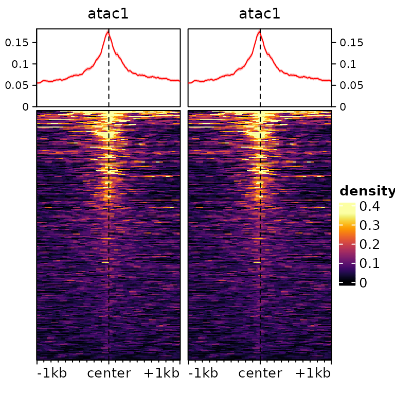 We can use most
arguments that are supported by
*[EnrichedHeatmap](https://bioconductor.org/packages/3.23/EnrichedHeatmap)*
(and thus, by extension, by
*[ComplexHeatmap](https://bioconductor.org/packages/3.23/ComplexHeatmap)*),
for example:

``` r

plotEnrichedHeatmaps(ese, colors=c("white","darkred"), cluster_rows=TRUE,
                     show_row_dend=TRUE, top_annotation=FALSE, 
                     row_title="My list of cool regions")
```

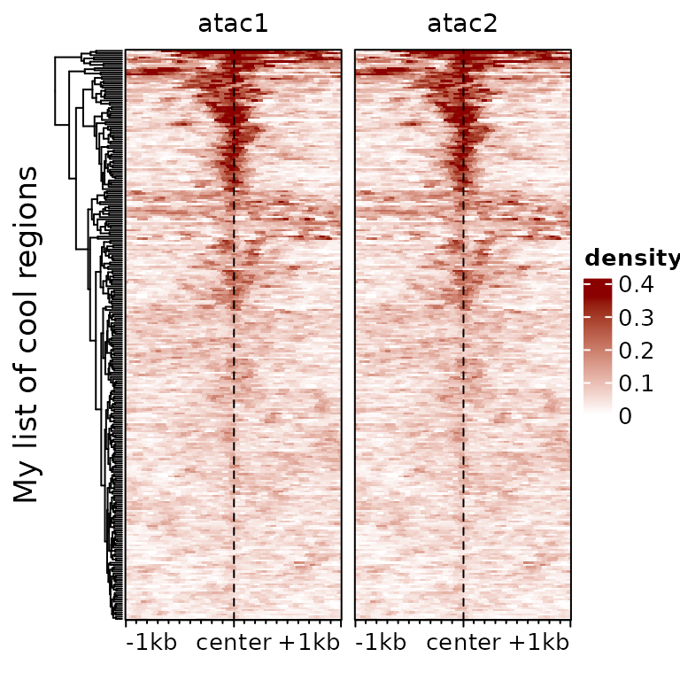 Note however that
the default clustering function is typically not ideal for such data –
see for instance
[`?clusterSignalMatrices`](https://ethz-ins.github.io/epiwraps/reference/clusterSignalMatrices.md)
instead.

It is often useful to subset to regions with a high enrichment, which we
can do with the `score` function:

``` r

plotEnrichedHeatmaps(ese[head(order(-rowMeans(score(ese))),50),])
```

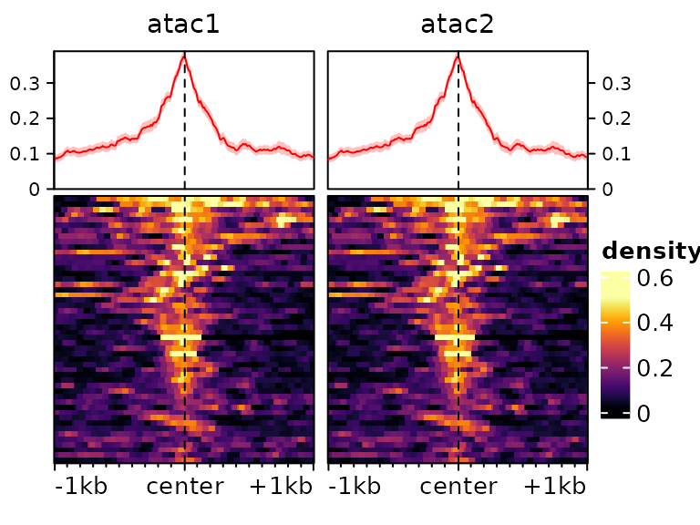

### Color-scale trimming

By default, the colorscale is trimmed to prevent most of it being driven
by rare extreme values. This can be controlled via the `trim` argument
(which indicates up to which quantile of data points to keep to
establish the colorscale). Compare for instance the following two
heatmaps:

``` r

plotEnrichedHeatmaps(ese[,1], trim=1, scale_title="trim=1", column_title="trim=1 (no trim)",
                     top_annotation=FALSE) +
  plotEnrichedHeatmaps(ese[,1], trim=0.99, scale_title="trim=0.99",
                       column_title="trim=0.99", top_annotation=FALSE) +
  plotEnrichedHeatmaps(ese[,1], trim=0.9, column_title="trim=0.9",
                       scale_title="trim=0.9", top_annotation=FALSE)
```

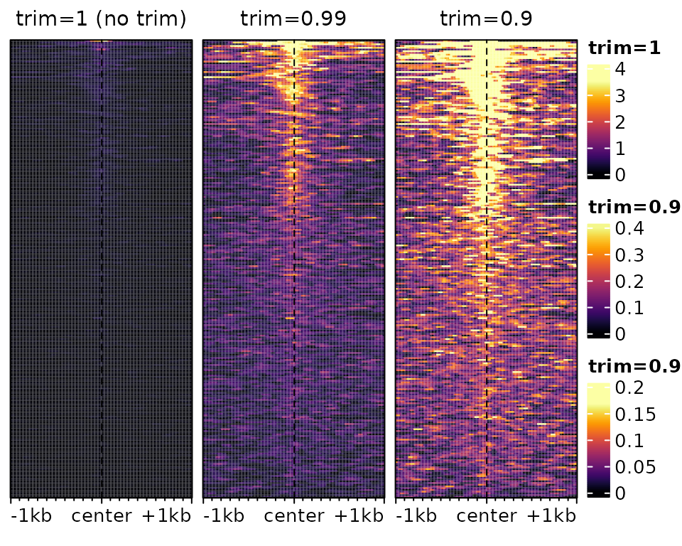

The underlying data is exactly the same, only the color-mapping changes.
In the left one, which has no trimming, a single very high value at the
top forces the colorscale to extend to high values, even though most of
the data is in the very low range, resulting in a very dark heatmap. In
the one on the right, it’s the opposite: so much is trimmed that many
points reach the top of the colorscale, resulting in a an ‘over-exposed’
heatmap. In practice, it is advisable to use minimal trimming (e.g. the
default is `c(0.02,0.98)`).

### Different colorscales for different tracks

It is also possible to have different colorscales for different tracks,
which is especially useful when comparing very different signals. To
illustrate this, let’s load an example with different tracks:

``` r

data(exampleESE)
exampleESE
```

    ## class: EnrichmentSE 
    ## 3 tracks across 150 regions
    ## assays(1): input
    ## rownames(150): chr1:36986026-36986320 chr1:36986855-36987064 ...
    ##   chr1:135509406-135510907 chr1:131525035-131527379
    ## rowData names(0):
    ## colnames(3): H3K27ac H3K4me3 p300
    ## colData names(0):
    ## metadata(0):

We can put each of the three tracks on its own color scale:

``` r

plotEnrichedHeatmaps(exampleESE, multiScale=TRUE)
```

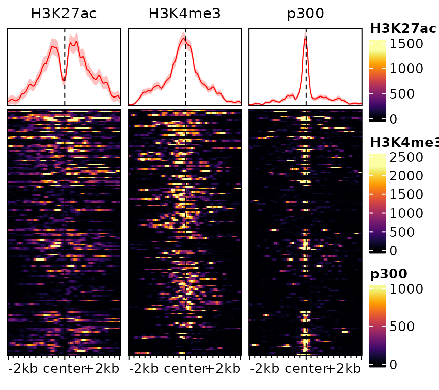

One could also specify colors separately by providing them as a list:

``` r

plotEnrichedHeatmaps(exampleESE,
                     colors=list(c("white","darkblue"), "darkgreen", "darkred"))
```

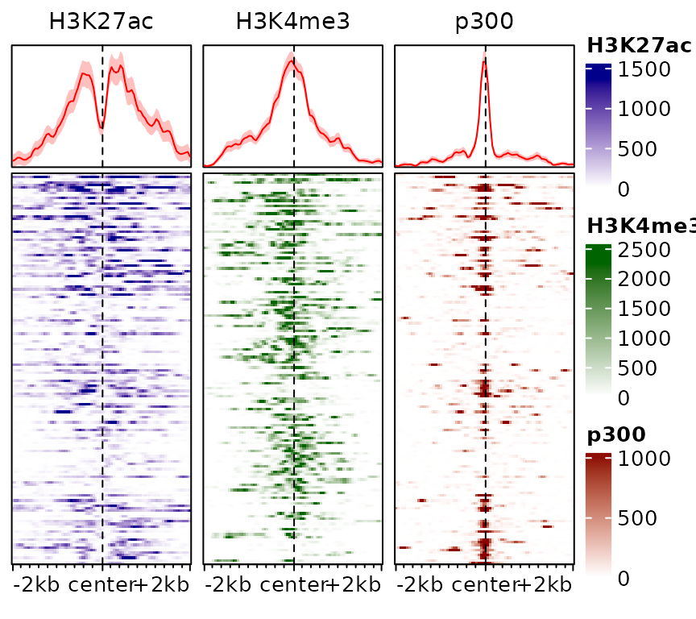

This information can also be stored in the object, rather than specified
everytime:

``` r

exampleESE$hmcolors <- list(viridisLite::inferno(100),  "darkgreen", "darkred")
plotEnrichedHeatmaps(exampleESE)
```

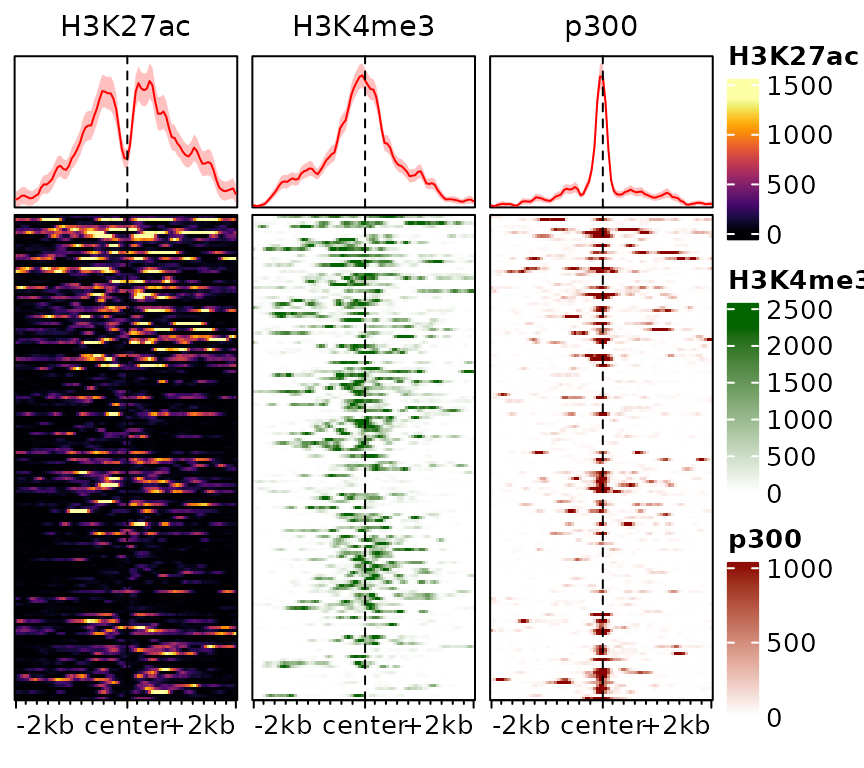

### Scaled regions

By default, `signal2Matrix` looks at a pre-defined interval (defined by
the `extend` argument) around the center of the provided regions. This
means that the width of the input regions is ignored. In some
circumstances, however, it can be useful to scale regions to the same
width, which can be done using the `type="scaled"` argument. Consider
the following example:

``` r

ese <- cbind(
  signal2Matrix(c(center=bwf), regions, extend=1000L),
  signal2Matrix(c(scaled=bwf), regions, extend=1000L, type="scaled")
)
```

    ## Reading /home/runner/work/_temp/Library/epiwraps/extdata/example_atac.bw
    ## Reading /home/runner/work/_temp/Library/epiwraps/extdata/example_atac.bw

``` r

plotEnrichedHeatmaps(ese)
```

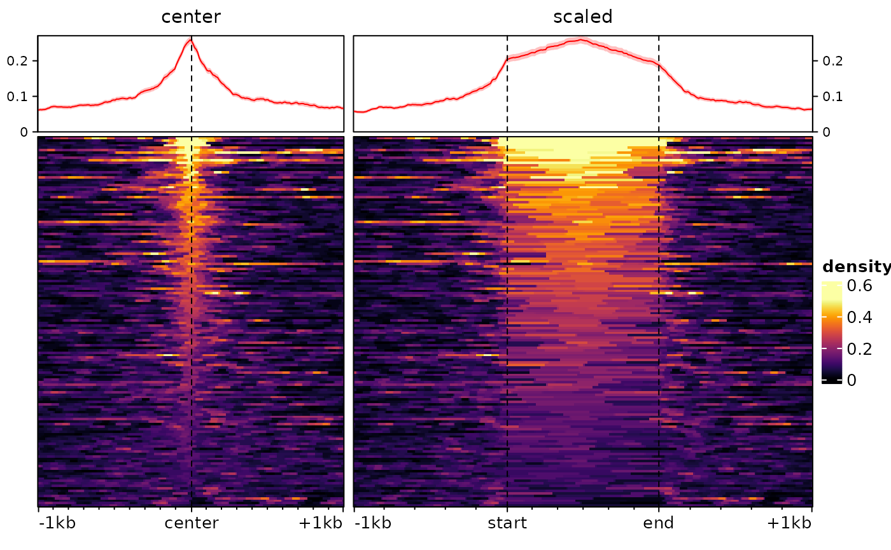

For some purposes, such as when plotting signal over transcripts, it can
be useful for the target region to consist of multiple regions
(e.g. exons) stitched together. This can be done by supplying a
`GRangesList` as regions:

``` r

# we make a dummy GRangesList:
a <- sort(rtracklayer::import(regions))
dummy.grl <- GRangesList(split(a, rep(LETTERS[1:15],each=10)))
sm <- signal2Matrix(c(scaled=bwf), dummy.grl, extend=1000L, type="scaled")
```

    ## Reading /home/runner/work/_temp/Library/epiwraps/extdata/example_atac.bw

``` r

plotEnrichedHeatmaps(sm)
```

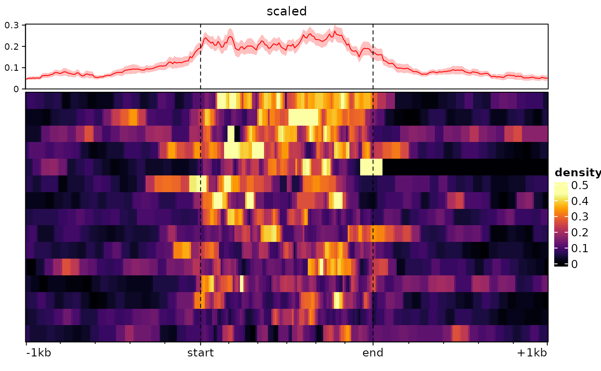

### Heatmap rasterization

When plotting more regions that there are pixels available, several
regions have to be summarized in one pixel, and doing this before
generating the heatmap makes the plot much less heavy.

By default, `EnrichedHeatmap` performs rasterization using the `magick`
package when it is installed, and falls back to a very suboptimal method
when not. It is therefore recommended to install the `magick` package.

Depending on your settings, if the heatmap is *very big* you might hit
the preset limits of ‘magick’ base rasterization, which could result in
an error such as ‘Image must have at least 1 frame to write a bitmap’.
In such cases, you might have to degrade to a lower-quality
rasterization using the additional arguments
`raster_by_magick=FALSE, raster_device="CairoJPEG"`.

Finally, on some systems, the rasterization sometimes encounters an
‘UnableToOpenBlob’ error. At the moment, the only workaround this has
been to disable rasterization using `use_raster=FALSE`.

## Sorting and clustering

The traditional ranking by decreasing overall enrichment can easily hide
patterns in the data, which are instead revealed by clustering. One
approach is to use hierarchical clustering of the rows:

``` r

plotEnrichedHeatmaps(exampleESE, cluster_rows=TRUE)
```

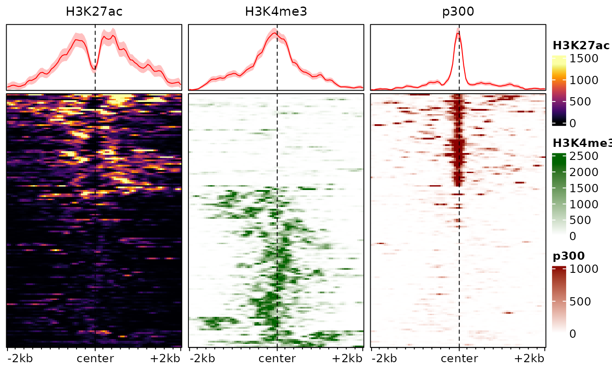

In this example, this already reveals important patterns in the data,
namely the fact that p300 binding is associated with H3K27ac and tends
to be mutually exclusive with the promoter-associated H3K4me3 mark.

The hierarchical clustering is based on the whole enrichment profile,
can easily be led astray by patterns in individual signals, and seldom
provides good results in practice. An alternative is to use enrichment
score weighted by distance to the center, eventually row-normalized, to
cluster the regions. We provide a function to this end:

``` r

# we cluster the regions using 2 clusters, and store the cluster labels in the 
# rowData of the object: 
rowData(exampleESE)$cluster <- clusterSignalMatrices(exampleESE, k=2, scaleRows=TRUE)
```

    ##   ~95% of the variance explained by clusters

``` r

# we additionally label the clusters with colors:
plotEnrichedHeatmaps(exampleESE, row_split="cluster",
                     mean_color=c("1"="red", "2"="blue"))
```

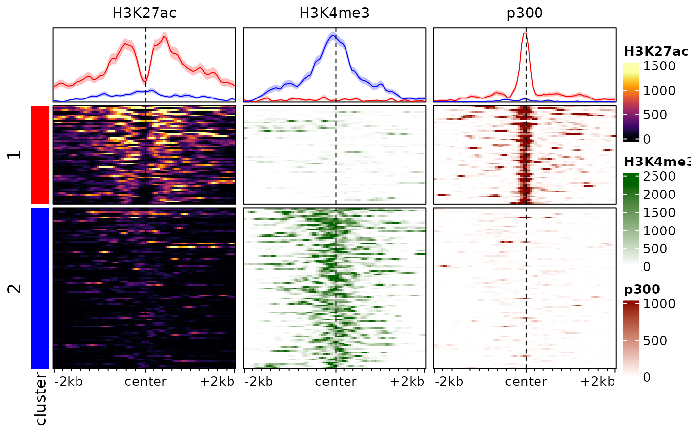

Note that here we are splitting into 3 clusters, you can also provide a
range of values (e.g. `k=2:8`) and the function will also return cluster
quality metrics for each.

Users can of course use their own algorithms to cluster regions. To this
end, it can be useful to summarize each region in each sample using a
single score which weights the signal according to the distance to the
center of the target (see
[`?EnrichedHeatmap::enriched_score`](https://rdrr.io/pkg/EnrichedHeatmap/man/enriched_score.html)).
This can be done for the default assay with the `score` method:

``` r

head(score(exampleESE))
```

    ##                           H3K27ac   H3K4me3     p300
    ## chr1:36986026-36986320   39609.53   341.850 27443.12
    ## chr1:36986855-36987064   48642.90   230.900 21184.08
    ## chr1:36061123-36061559   26838.05   313.025 20699.60
    ## chr1:36060725-36060951   34205.22   330.125 20061.05
    ## chr1:180888607-180889217 20013.45  2019.725 22293.35
    ## chr1:86487735-86488859   20008.00 26012.825  1265.85

## Plotting aggregated signals

It is also possible to plot only the average signals across regions. To
do this, we first melt the signal matrices and then use
*[ggplot2](https://CRAN.R-project.org/package=ggplot2)*. The
`meltSignals` function will return a data.frame showing the mean,
standard deviation, standard error and median at each position relative
to the center, for each sample/matrix:

``` r

d <- meltSignals(exampleESE)
head(d)
```

    ##   position  sample     mean       SD       SE median
    ## 1    -2000 H3K27ac 83.28000 182.5112 14.90197   11.5
    ## 2    -1950 H3K27ac 85.87333 189.9628 15.51040   11.5
    ## 3    -1900 H3K27ac 91.19333 207.2911 16.92525    9.0
    ## 4    -1850 H3K27ac 90.92000 201.2272 16.43013    8.5
    ## 5    -1800 H3K27ac 88.02667 192.6586 15.73051   10.0
    ## 6    -1750 H3K27ac 85.52000 173.5301 14.16867   14.5

This can then be used for plotting, simply with `ggplot`:

``` r

library(ggplot2)
ggplot(d, aes(position, mean, colour=sample)) +
  geom_vline(xintercept=0, linetype="dashed") +
  geom_ribbon(aes(position, ymin=mean-SE, ymax=mean+SE, fill=sample), alpha=0.4, colour=NA) + 
  geom_line(linewidth=1.2) + 
  theme_bw() + labs(x="relative position", y="mean RPKM")
```

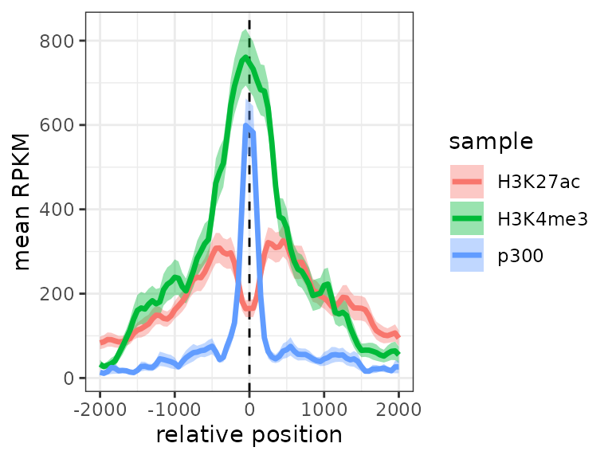

We could also include cluster information:

``` r

d <- meltSignals(exampleESE, splitBy = "cluster")
ggplot(d, aes(position, mean, colour=sample)) +
  geom_vline(xintercept=0, linetype="dashed") +
  geom_ribbon(aes(position, ymin=mean-SE, ymax=mean+SE, fill=sample), alpha=0.4, colour=NA) + 
  geom_line(linewidth=1.2) + facet_wrap(~split) +
  theme_bw() + labs(x="relative position", y="mean RPKM")
```

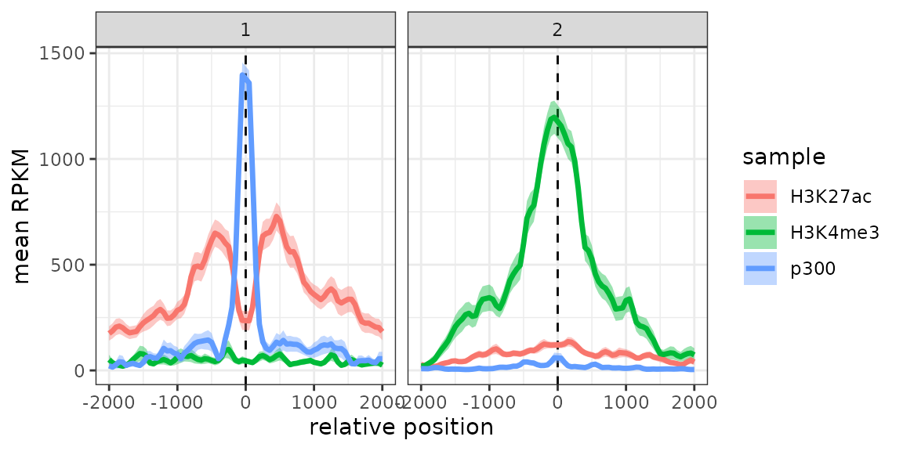

## Visualizing DNAme and sparse signals

Nucleotide-resolution DNA methylation (as obtained from bisulfite
sequencing) signal differs from the signals used throughout this
vignette in that it is not continuous across the genome, but
specifically at C or CpG nucleotides which have a variable density
throughout the genome. As a consequence, it is likely that some of the
plotting bins do not contain a CpG, in which case they get assigned a
value of 0, even though they could be in a completely methylated region.
For this reason, it is advisable to smooth DNA methylation signals for
the purpose of visualization.

As an example, let’s look at the gene bodies of some active genes from
chr8 of the A549 cell lines:

``` r

data("exampleDNAme")
head(exampleDNAme)
```

    ## UnstitchedGPos object with 6 positions and 1 metadata column:
    ##       seqnames       pos strand |     score
    ##          <Rle> <integer>  <Rle> | <integer>
    ##   [1]     chr9   4791172      + |        96
    ##   [2]     chr9   4791391      + |        96
    ##   [3]     chr9   4791398      + |       100
    ##   [4]     chr9   4791422      + |        92
    ##   [5]     chr9   4791437      + |        82
    ##   [6]     chr9   4791627      + |        93
    ##   -------
    ##   seqinfo: 5 sequences from an unspecified genome; no seqlengths

As is typical of DNAme data, the object is a GRanges object (or more
specifically a GPos object, since all ranges have a width of 1
nucleotide) with, in the score column, the percentage of DNA
methylation. Let’s see what happens if we plot a heatmap of this signal,
with and without smoothing.

``` r

o1 <- signal2Matrix(list(noSmooth=exampleDNAme), geneBodies, type="scaled")
```

    ## Computing signal from GRanges 'noSmooth'...

``` r

o2 <- signal2Matrix(list(smoothed=exampleDNAme), geneBodies, type="scaled", 
                    smooth=TRUE, limit=c(0,100)) # recommended for DNAme
```

    ## Computing signal from GRanges 'smoothed'...

``` r

# we add a third one to visualize the CpGs:
o3 <- signal2Matrix(list("noSmooth only CpGs"=exampleDNAme), geneBodies, type="scaled", background=NA)
```

    ## Computing signal from GRanges 'noSmooth only CpGs'...

``` r

o <- cbind(o1,o2,o3)
plotEnrichedHeatmaps(o, scale_title="%\nmethylation", axis_name=c("TSS","TES"))
```

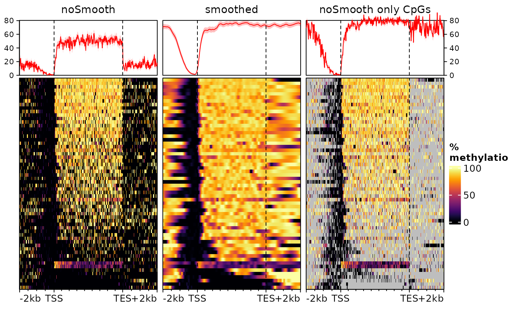

Here we use `type="scaled"` to scale the gene bodies to the same size,
since these can have very different sizes. The first heatmap is the
default (no smoothing), while the center one uses smoothing (note that
we cap values from 0 to 100 to avoid smoothing artefacts). The third
doesn’t use smoothing, but only display values for bins that contain a
CpG.

All heatmaps show a very clear absence of DNA methylation at the
promoter of these genes (upstream of the TSS) and predominantly
methylated gene bodies. However they disagree substantially on the
methylation levels upstream the promoter and downstream the
transcription end sites (TES). This is because of the density of these
regions in (covered) CpG nucleotides. Since most genes are rather long,
most of the bins in the gene body heatmap contain a CpG, leading to an
actual methylation signal. In the flanking regions, however, this is not
necessarily the case, and the left heatmap does not distinguish bins
that are unmethylated form bins for which there is no information. On
the right heatmap, we can see that regions downstream the TES are
CpG-depleted. Instead, the smoothed heatmap (center) uses neighboring
bins to estimate the methylation status of each bin, effectively filling
out the gaps. In doing so it provides the truthful representation,
i.e. that the regions downstream of the genes and upstream of the
promoters are, most of the time, as methylated as the gene bodies.

Smoothing is performed by
*[EnrichedHeatmap](https://bioconductor.org/packages/3.23/EnrichedHeatmap)*;
see
[`?EnrichedHeatmap::normalizeToMatrix`](https://rdrr.io/pkg/EnrichedHeatmap/man/normalizeToMatrix.html)
for more information/customization.

  
  

## Session information

``` r

sessionInfo()
```

    ## R version 4.6.0 (2026-04-24)
    ## Platform: x86_64-pc-linux-gnu
    ## Running under: Ubuntu 24.04.4 LTS
    ## 
    ## Matrix products: default
    ## BLAS:   /usr/lib/x86_64-linux-gnu/openblas-pthread/libblas.so.3 
    ## LAPACK: /usr/lib/x86_64-linux-gnu/openblas-pthread/libopenblasp-r0.3.26.so;  LAPACK version 3.12.0
    ## 
    ## locale:
    ##  [1] LC_CTYPE=C.UTF-8       LC_NUMERIC=C           LC_TIME=C.UTF-8       
    ##  [4] LC_COLLATE=C.UTF-8     LC_MONETARY=C.UTF-8    LC_MESSAGES=C.UTF-8   
    ##  [7] LC_PAPER=C.UTF-8       LC_NAME=C              LC_ADDRESS=C          
    ## [10] LC_TELEPHONE=C         LC_MEASUREMENT=C.UTF-8 LC_IDENTIFICATION=C   
    ## 
    ## time zone: UTC
    ## tzcode source: system (glibc)
    ## 
    ## attached base packages:
    ## [1] grid      stats4    stats     graphics  grDevices utils     datasets 
    ## [8] methods   base     
    ## 
    ## other attached packages:
    ##  [1] ggplot2_4.0.3               epiwraps_0.99.115          
    ##  [3] EnrichedHeatmap_1.42.0      ComplexHeatmap_2.28.0      
    ##  [5] SummarizedExperiment_1.42.0 Biobase_2.72.0             
    ##  [7] GenomicRanges_1.64.0        Seqinfo_1.2.0              
    ##  [9] IRanges_2.46.0              S4Vectors_0.50.0           
    ## [11] BiocGenerics_0.58.0         generics_0.1.4             
    ## [13] MatrixGenerics_1.24.0       matrixStats_1.5.0          
    ## [15] BiocStyle_2.40.0           
    ## 
    ## loaded via a namespace (and not attached):
    ##   [1] RColorBrewer_1.1-3       rstudioapi_0.18.0        jsonlite_2.0.0          
    ##   [4] shape_1.4.6.1            magrittr_2.0.5           magick_2.9.1            
    ##   [7] GenomicFeatures_1.64.0   farver_2.1.2             rmarkdown_2.31          
    ##  [10] GlobalOptions_0.1.4      fs_2.1.0                 BiocIO_1.22.0           
    ##  [13] ragg_1.5.2               vctrs_0.7.3              memoise_2.0.1           
    ##  [16] Rsamtools_2.28.0         RCurl_1.98-1.18          base64enc_0.1-6         
    ##  [19] htmltools_0.5.9          S4Arrays_1.12.0          progress_1.2.3          
    ##  [22] curl_7.1.0               SparseArray_1.12.2       Formula_1.2-5           
    ##  [25] sass_0.4.10              bslib_0.10.0             htmlwidgets_1.6.4       
    ##  [28] desc_1.4.3               Gviz_1.56.0              httr2_1.2.2             
    ##  [31] cachem_1.1.0             GenomicAlignments_1.48.0 lifecycle_1.0.5         
    ##  [34] iterators_1.0.14         pkgconfig_2.0.3          Matrix_1.7-5            
    ##  [37] R6_2.6.1                 fastmap_1.2.0            clue_0.3-68             
    ##  [40] digest_0.6.39            colorspace_2.1-2         AnnotationDbi_1.74.0    
    ##  [43] textshaping_1.0.5        Hmisc_5.2-5              RSQLite_2.4.6           
    ##  [46] labeling_0.4.3           filelock_1.0.3           httr_1.4.8              
    ##  [49] abind_1.4-8              compiler_4.6.0           withr_3.0.2             
    ##  [52] bit64_4.8.0              doParallel_1.0.17        backports_1.5.1         
    ##  [55] htmlTable_2.5.0          S7_0.2.2                 BiocParallel_1.46.0     
    ##  [58] DBI_1.3.0                biomaRt_2.68.0           rappdirs_0.3.4          
    ##  [61] DelayedArray_0.38.1      rjson_0.2.23             tools_4.6.0             
    ##  [64] foreign_0.8-91           nnet_7.3-20              glue_1.8.1              
    ##  [67] restfulr_0.0.16          checkmate_2.3.4          cluster_2.1.8.2         
    ##  [70] gtable_0.3.6             BSgenome_1.80.0          ensembldb_2.36.0        
    ##  [73] data.table_1.18.2.1      hms_1.1.4                XVector_0.52.0          
    ##  [76] foreach_1.5.2            pillar_1.11.1            stringr_1.6.0           
    ##  [79] circlize_0.4.18          dplyr_1.2.1              BiocFileCache_3.2.0     
    ##  [82] lattice_0.22-9           deldir_2.0-4             rtracklayer_1.72.0      
    ##  [85] bit_4.6.0                biovizBase_1.60.0        tidyselect_1.2.1        
    ##  [88] locfit_1.5-9.12          pbapply_1.7-4            Biostrings_2.80.0       
    ##  [91] knitr_1.51               gridExtra_2.3            bookdown_0.46           
    ##  [94] ProtGenerics_1.44.0      xfun_0.57                stringi_1.8.7           
    ##  [97] UCSC.utils_1.8.0         lazyeval_0.2.3           yaml_2.3.12             
    ## [100] evaluate_1.0.5           codetools_0.2-20         cigarillo_1.2.0         
    ## [103] interp_1.1-6             GenomicFiles_1.48.0      tibble_3.3.1            
    ## [106] BiocManager_1.30.27      cli_3.6.6                rpart_4.1.27            
    ## [109] systemfonts_1.3.2        jquerylib_0.1.4          dichromat_2.0-0.1       
    ## [112] Rcpp_1.1.1-1.1           GenomeInfoDb_1.48.0      dbplyr_2.5.2            
    ## [115] png_0.1-9                XML_3.99-0.23            parallel_4.6.0          
    ## [118] pkgdown_2.2.0            blob_1.3.0               prettyunits_1.2.0       
    ## [121] jpeg_0.1-11              latticeExtra_0.6-31      AnnotationFilter_1.36.0 
    ## [124] bitops_1.0-9             viridisLite_0.4.3        VariantAnnotation_1.58.0
    ## [127] scales_1.4.0             crayon_1.5.3             GetoptLong_1.1.1        
    ## [130] rlang_1.2.0              cowplot_1.2.0            KEGGREST_1.52.0
