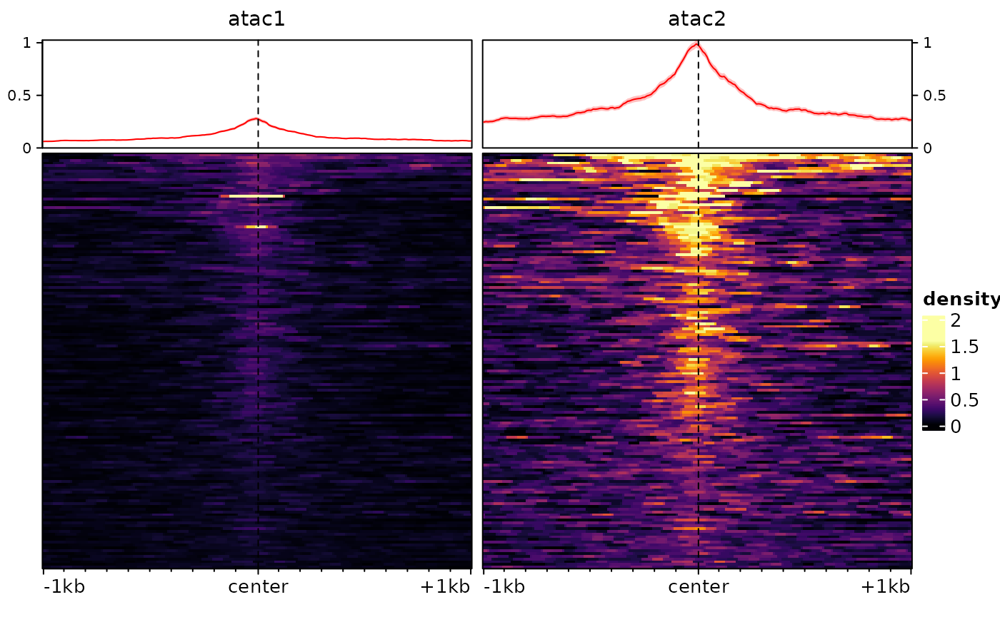
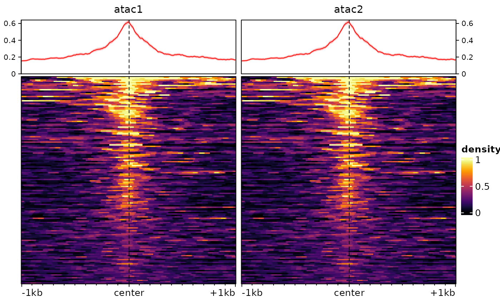

# Normalizing genomic signals

Abstract

This vignette covers the functions for normalizing genomic signals.
Since this is illustrated with visualization, it is recommended that you
read the `bam2bw` and `multiRegionPlot` vignettes first.

## Introduction

`epiwraps` includes two ways of calculating normalization factors:
either from the signal files (e.g. bam or bigwig files), which is the
most robust way and enables all options, or from an `EnrichmentSE`
object (see the [multiRegionPlot
vignette](https://ethz-ins.github.io/epiwraps/articles/multiRegionPlot.md)
for an intro to such an object) or signal matrices. In both cases, the
logic is the same: we estimate normalization factors (mostly single
linear scaling factors, although some methods involve more complex
normalization), and then apply them to signals that were extracted using
[`signal2Matrix()`](https://ethz-ins.github.io/epiwraps/reference/signal2Matrix.md).

### Applying normalization factors when generating the bigwig files

It is possible to also directly use computed normalization factors when
creating bigwig files. By default, the
[`bam2bw() function`](https://ethz-ins.github.io/epiwraps/articles/bam2bw.md)
scales using library size, which can be disabled using `scaling=FALSE`.
However, it is also possible to pass the `scaling` argument a manual
scaling factor, as computed by the functions described here. In this
vignette, however, we will focus on normalizing signal matrices.

## Obtaining normalization factors for a set of signal files

The
[`getNormFactors()`](https://ethz-ins.github.io/epiwraps/reference/getNormFactors.md)
function can be used to estimate normalization factors from either bam
or bigwig files. The files cannot be mixed (bam/bigwig), however, and it
is important to note that *normalization factors calculated on bam files
cannot be applied to data extracted from bigwig files, or vice versa*,
because the bigwig files are by default already normalized for library
size. If needed, however,
[`getNormFactors()`](https://ethz-ins.github.io/epiwraps/reference/getNormFactors.md)
can be used to apply the same method to both kind of files.

### Normalization methods

Simple library size normalization, as done by
[`bam2bw()`](https://ethz-ins.github.io/epiwraps/reference/bam2bw.md),
is not always appropriate. The main reasons are 1) that different
samples/experiments can have a different signal-to-noise ratio, with the
result that more sequencing is needed to obtain a similar coverage of
enriched region; 2) that there might be global differences in the amount
of the signal of interest (e.g. more or less binding, globally, in one
cell type vs another); and 3) that there might be differences in
technical biases, such as GC content. For these reasons, different
normalization methods are needed according to circumstances and what
assumptions seem reasonable. Here is an overview of the normalization
methods currently implemented in `epiwraps` via the
[`getNormFactors()`](https://ethz-ins.github.io/epiwraps/reference/getNormFactors.md)
function:

- The ‘background’ or ‘SES’ normalization method (they are synonyms
  here) assumes that the background noise should on average be the same
  across experiments ([Diaz et al., Stat Appl Gen et Mol Biol,
  2012](https://doi.org/10.1515/1544-6115.1750)), an assumption that
  works well in practice and is robust to global differences in the
  amount of signal when there are not large differences in
  signal-to-noise ratio.
- The ‘MAnorm’ approach ( [Shao et al., Genome Biology
  2012](https://doi.org/10.1186/gb-2012-13-3-r16)) assumes that regions
  that are commonly enriched (i.e.  common peaks) in two experiments
  should on average have the same signal in the two experiments.
- The ‘enriched’ approach assumes that enriched regions are on average
  similarly enriched across samples. Contrarily to ‘MAnorm’, these
  regions do not need to be in common across samples/experiments. This
  is not robust to global differences.
- The ‘top’ approach assumes that the maximum enrichment (after some
  trimming) in peaks is the same across samples/experiments.
- The ‘S3norm’ ([Xiang et al., NAR
  2020](https://doi.org/10.1093/nar/gkaa105)) and ‘2cLinear’ methods try
  to normalize both enrichment and background simultaneously. S3norm
  does this in a log-linear fashion (as in the publication), while
  ‘2cLinear’ does it on the original scale.

The normalization factors can be computed using
[`getNormFactors()`](https://ethz-ins.github.io/epiwraps/reference/getNormFactors.md)
:

``` r
suppressPackageStartupMessages(library(epiwraps))
# we fetch the path to the example bigwig file:
bwf <- system.file("extdata/example_atac.bw", package="epiwraps")
# we'll just double it to create a fake multi-sample dataset:
bwfiles <- c(atac1=bwf, atac2=bwf)
nf <- getNormFactors(bwfiles, method="background")
```

    ## Comparing coverage in random regions...

``` r
nf
```

    ## atac1 atac2 
    ##     1     1

In this case, since the files are identical, the factors are both 1.

Some normalization methods additionally require peaks as input, e.g.:

``` r
peaks <- system.file("extdata/example_peaks.bed", package="epiwraps")
nf <- getNormFactors(bwfiles, peaks = peaks, method="MAnorm")
```

    ## Comparing coverage in peaks...

    ## calcNormFactors has been renamed to normLibSizes
    ## calcNormFactors has been renamed to normLibSizes

(Note that MAnorm would normally require to have a list of peaks for
each sample/experiment).

Once computed, the normalization factors can be applied to an
`EnrichmentSE` object:

``` r
sm <- signal2Matrix(bwfiles, peaks, extend=1000L)
```

    ## Reading /home/runner/work/_temp/Library/epiwraps/extdata/example_atac.bw
    ## Reading /home/runner/work/_temp/Library/epiwraps/extdata/example_atac.bw

``` r
sm <- renormalizeSignalMatrices(sm, scaleFactors=nf)
sm
```

    ## class: EnrichmentSE 
    ## 2 tracks across 150 regions
    ## assays(2): normalized input
    ## rownames(150): 1:195054101-195054250 1:133522798-133523047 ...
    ##   1:22224734-22224983 1:90375438-90375787
    ## rowData names(0):
    ## colnames(2): atac1 atac2
    ## colData names(0):
    ## metadata(0):

The object now has a new assay, called `normalized`, which has been put
in front and therefore will be used for most downstream usages unless
the uses specifies otherwise. Note that for any downstream function it
is however possible to specify which assay to use via the `assay`
argument.

## Obtaining normalization factors from the signal matrices themselves

It is also possible to normalize the signal matrices using factors
derived from the matrices themselves, using the
`renormalizeSignalMatrices` function. Note that this is provided as a
‘quick-and-dirty’ approach that does not have the robustness of proper
estimation methods. Specifically, beyond providing manual scaling
factors (e.g. computed using `getNormFactors`), the function includes
two methods :

- `method="border"` works on the assumption that the left/right borders
  of the matrices represent background signal which should be equal
  across samples. As such, it can be seen as an approximation of the
  aforementioned background normalization. However, it will work only
  if 1) the left/right borders of the matrices are sufficiently far from
  the signal (e.g. peaks) to be chiefly noise, and (as with the main
  background normalization method itself) 2) the signal-to-noise ratio
  is comparable across tracks/samples.
- `method="top"` instead works on the assumption that the highest signal
  (after some eventual trimming of the extremes) should be the same
  across tracks/samples.

To illustrate these, we will first introduce some difference between our
two tracks using arbitrary factors:

``` r
sm <- renormalizeSignalMatrices(sm, scaleFactors=c(1,4), toAssay="test")
plotEnrichedHeatmaps(sm, assay = "test")
```



Then we can normalize:

``` r
sm <- renormalizeSignalMatrices(sm, method="top", fromAssay="test")
# again this adds an assay to the object, which will be automatically used when plotting:
plotEnrichedHeatmaps(sm)
```

    ## Using assay topNormalized



And we’ve recovered comparable signal across the two tracks/samples.

  
  

## Session information

``` r
sessionInfo()
```

    ## R version 4.6.0 (2026-04-24)
    ## Platform: x86_64-pc-linux-gnu
    ## Running under: Ubuntu 24.04.4 LTS
    ## 
    ## Matrix products: default
    ## BLAS:   /usr/lib/x86_64-linux-gnu/openblas-pthread/libblas.so.3 
    ## LAPACK: /usr/lib/x86_64-linux-gnu/openblas-pthread/libopenblasp-r0.3.26.so;  LAPACK version 3.12.0
    ## 
    ## locale:
    ##  [1] LC_CTYPE=C.UTF-8       LC_NUMERIC=C           LC_TIME=C.UTF-8       
    ##  [4] LC_COLLATE=C.UTF-8     LC_MONETARY=C.UTF-8    LC_MESSAGES=C.UTF-8   
    ##  [7] LC_PAPER=C.UTF-8       LC_NAME=C              LC_ADDRESS=C          
    ## [10] LC_TELEPHONE=C         LC_MEASUREMENT=C.UTF-8 LC_IDENTIFICATION=C   
    ## 
    ## time zone: UTC
    ## tzcode source: system (glibc)
    ## 
    ## attached base packages:
    ## [1] grid      stats4    stats     graphics  grDevices utils     datasets 
    ## [8] methods   base     
    ## 
    ## other attached packages:
    ##  [1] epiwraps_0.99.113           EnrichedHeatmap_1.41.1     
    ##  [3] ComplexHeatmap_2.27.1       SummarizedExperiment_1.41.1
    ##  [5] Biobase_2.71.0              GenomicRanges_1.63.2       
    ##  [7] Seqinfo_1.1.0               IRanges_2.45.0             
    ##  [9] S4Vectors_0.49.2            BiocGenerics_0.57.1        
    ## [11] generics_0.1.4              MatrixGenerics_1.23.0      
    ## [13] matrixStats_1.5.0           BiocStyle_2.39.0           
    ## 
    ## loaded via a namespace (and not attached):
    ##   [1] RColorBrewer_1.1-3       rstudioapi_0.18.0        jsonlite_2.0.0          
    ##   [4] shape_1.4.6.1            magrittr_2.0.5           magick_2.9.1            
    ##   [7] GenomicFeatures_1.63.2   farver_2.1.2             rmarkdown_2.31          
    ##  [10] GlobalOptions_0.1.4      fs_2.1.0                 BiocIO_1.21.0           
    ##  [13] ragg_1.5.2               vctrs_0.7.3              memoise_2.0.1           
    ##  [16] Rsamtools_2.27.2         RCurl_1.98-1.18          base64enc_0.1-6         
    ##  [19] htmltools_0.5.9          S4Arrays_1.11.1          progress_1.2.3          
    ##  [22] curl_7.1.0               SparseArray_1.11.13      Formula_1.2-5           
    ##  [25] sass_0.4.10              bslib_0.10.0             htmlwidgets_1.6.4       
    ##  [28] desc_1.4.3               Gviz_1.55.0              httr2_1.2.2             
    ##  [31] cachem_1.1.0             GenomicAlignments_1.47.0 lifecycle_1.0.5         
    ##  [34] iterators_1.0.14         pkgconfig_2.0.3          Matrix_1.7-5            
    ##  [37] R6_2.6.1                 fastmap_1.2.0            clue_0.3-68             
    ##  [40] digest_0.6.39            colorspace_2.1-2         AnnotationDbi_1.73.1    
    ##  [43] textshaping_1.0.5        Hmisc_5.2-5              RSQLite_2.4.6           
    ##  [46] filelock_1.0.3           httr_1.4.8               abind_1.4-8             
    ##  [49] compiler_4.6.0           bit64_4.8.0              doParallel_1.0.17       
    ##  [52] backports_1.5.1          htmlTable_2.5.0          S7_0.2.2                
    ##  [55] BiocParallel_1.45.0      DBI_1.3.0                biomaRt_2.67.7          
    ##  [58] rappdirs_0.3.4           DelayedArray_0.37.1      rjson_0.2.23            
    ##  [61] tools_4.6.0              foreign_0.8-91           nnet_7.3-20             
    ##  [64] glue_1.8.1               restfulr_0.0.16          checkmate_2.3.4         
    ##  [67] cluster_2.1.8.2          gtable_0.3.6             BSgenome_1.79.1         
    ##  [70] ensembldb_2.35.0         data.table_1.18.2.1      hms_1.1.4               
    ##  [73] XVector_0.51.0           foreach_1.5.2            pillar_1.11.1           
    ##  [76] stringr_1.6.0            limma_3.67.3             circlize_0.4.18         
    ##  [79] dplyr_1.2.1              BiocFileCache_3.1.0      lattice_0.22-9          
    ##  [82] deldir_2.0-4             rtracklayer_1.71.3       bit_4.6.0               
    ##  [85] biovizBase_1.59.0        tidyselect_1.2.1         locfit_1.5-9.12         
    ##  [88] pbapply_1.7-4            Biostrings_2.79.5        knitr_1.51              
    ##  [91] gridExtra_2.3            bookdown_0.46            ProtGenerics_1.43.0     
    ##  [94] edgeR_4.9.9              xfun_0.57                statmod_1.5.1           
    ##  [97] stringi_1.8.7            UCSC.utils_1.7.1         lazyeval_0.2.3          
    ## [100] yaml_2.3.12              evaluate_1.0.5           codetools_0.2-20        
    ## [103] cigarillo_1.1.0          interp_1.1-6             GenomicFiles_1.47.0     
    ## [106] tibble_3.3.1             BiocManager_1.30.27      cli_3.6.6               
    ## [109] rpart_4.1.27             systemfonts_1.3.2        jquerylib_0.1.4         
    ## [112] dichromat_2.0-0.1        Rcpp_1.1.1-1             GenomeInfoDb_1.47.2     
    ## [115] dbplyr_2.5.2             png_0.1-9                XML_3.99-0.23           
    ## [118] parallel_4.6.0           pkgdown_2.2.0            ggplot2_4.0.3           
    ## [121] blob_1.3.0               prettyunits_1.2.0        jpeg_0.1-11             
    ## [124] latticeExtra_0.6-31      AnnotationFilter_1.35.0  bitops_1.0-9            
    ## [127] viridisLite_0.4.3        VariantAnnotation_1.57.1 scales_1.4.0            
    ## [130] crayon_1.5.3             GetoptLong_1.1.1         rlang_1.2.0             
    ## [133] cowplot_1.2.0            KEGGREST_1.51.1
