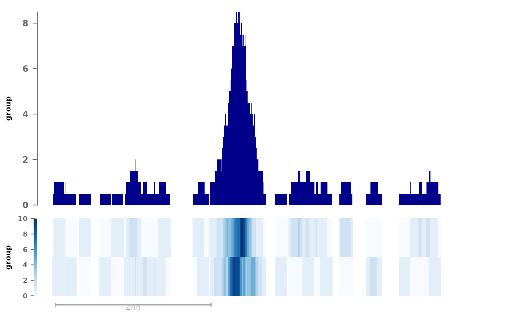
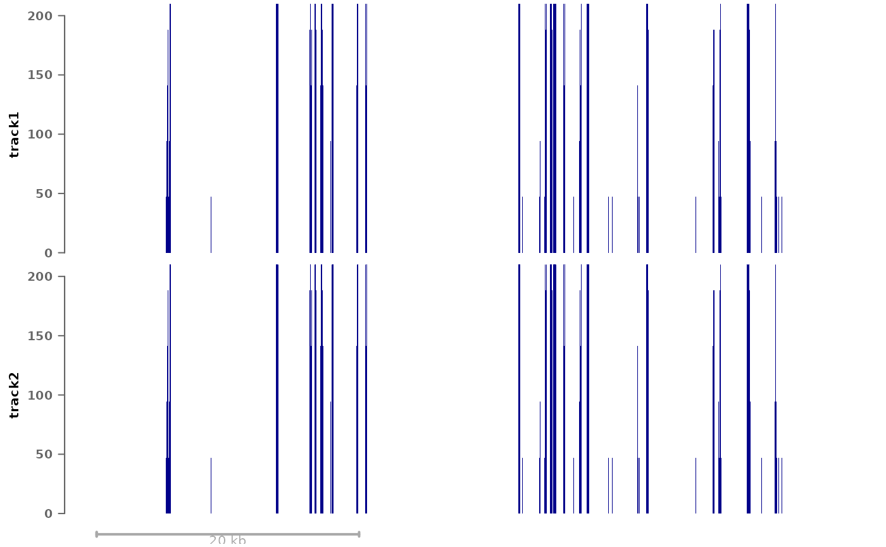

# Visualizing signals in a single region

Abstract

This vignette documents the use of the ‘plotSignalTracks’ to generate
genome-browser-like plots of signals and annotations along genomic
coordinates in a single given region. It is chiefly a wrapper around the
‘Gviz’ package.

## Plotting signals in a region

The `plotSignalTracks` function is a wrapper around the
*[Gviz](https://bioconductor.org/packages/3.23/Gviz)* package, which
plots one or more signals along genomic coordinates (in a genome-browser
like fashion). The function lacks the full flexibility of the
*[Gviz](https://bioconductor.org/packages/3.23/Gviz)* package, but
presents a considerable simpler interface, with automatic default
parameters, etc. It has two essential arguments: a (named) list of files
whose signal to display (can be a mixture of bigwig, bam, or bed-like
files), and the region in which to display the signals (can be given as
a GRanges or as a string). The function then automatically determines
the relevant track type and setting from the file types.

``` r
suppressPackageStartupMessages(library(epiwraps))

# get the path to an example bigwig file:
bwf1 <- system.file("extdata/example_rna.bw", package="epiwraps")
plotSignalTracks(list(RNA=bwf1), region="8:22165140-22212326", genomeAxis=TRUE)
```


``` r
# we could plot multiple tracks as follows:
plotSignalTracks(list(track1=bwf1, track2=bwf1), region="8:22165140-22212326")
```


`GRanges` objects can also be plotted as annotation tracks alongside
other data:

``` r
myregions <- GRanges("8", IRanges(c(22166000,22202300), width=3000))
plotSignalTracks(list(RNA=bwf1, regions=myregions), region="8:22165140-22212326")
```


Colors, track display types, and such parameters can either be set for
all tracks or for each individual track, for example:

``` r
myregions <- GRanges("8", IRanges(c(22166000,22202300), width=3000))
plotSignalTracks(list(RNA=bwf1, regions=myregions), colors=c("red", "black"),
                 region="8:22165140-22212326")
```


For bam files, we can also plot individual reads:

``` r
# we fetch an example bam file:
bam <- system.file("extdata", "ex1.bam", package="Rsamtools")
plotSignalTracks(c("my bam file"=bam), "seq1:1-1500", type="alignments")
```

    ## Warning in call_new_fun_in_cigarillo("sequenceLayer", "project_sequences", : sequenceLayer() is formally deprecated in GenomicAlignments >= 1.45.5 and
    ##   replaced with the project_sequences() function from the new cigarillo package


### Merging signal from different tracks

In addition to being displayed one below the other, data tracks can be
combined in different ways. To do this, the tracks can simply be given
in a nested fashion:

``` r
plotSignalTracks(list(track1=bwf1, combined=c(bwf1,bwf1)),
                 region="8:22165140-22212326")
```

In this example we are always using the same track, but the first
element (‘track1’) plots the track alone, while the second (‘combined’)
merges the two given tracks. By default, the mean is shown, but this can
be controlled through the `aggregation` argument. In addition to usual
operations, the tracks can be overlayed on top of one another
(`aggregation='overlay'`), or shown as a heatmap
(`aggregation='heatmap'`), or a mean track with heatmap below
(`aggregation="heatmap+mean"`).

To better illustrate this, we’ll generate two dummy tracks:

``` r
bw1 <- tempfile(fileext=".bw")
cov1 <- GRanges("chr1", IRanges(1L+round(c(500+rnorm(15, sd=20),1000*runif(20))), width=30))
bw2 <- tempfile(fileext=".bw")
cov2 <- GRanges("chr1", IRanges(1L+abs(round(c(490+rnorm(15, sd=30),1000*runif(20)))), width=30))
seqlengths(cov1) <- seqlengths(cov2) <- c("chr1"=1500)
rtracklayer::export.bw(coverage(cov1), bw1)
rtracklayer::export.bw(coverage(cov2), bw2)
```

Then we can plot them as replicates:

``` r
plotSignalTracks(list(group=c(bw1, bw2)), region="chr1:1-1030", aggregation="heatmap+mean")
```

 We find this
representation particularly useful, as it combines the visual
interpretability of the track, while simultaneously providing
information about the variability across replicates in a compact
fashion.

### Using an EnsDb object

If an `EnsDb` object is available (see the
*[ensembldb](https://bioconductor.org/packages/3.23/ensembldb)* package
for a description of the class and its methods, and the
*[AnnotationHub](https://bioconductor.org/packages/3.23/AnnotationHub)*
package for a convenient way of fetching such annotation objects), two
additional options are available: first, instead of specifying the
region as coordinates, one can specify a gene or transcript name, and
the corresponding region will be fetched. In addition, the genes or
transcripts can be displayed. For example:

``` r
# we fetch the GRCh38 Ensembl 103 annotation (this is not run in the vignette,
# as it takes some time to download the annotation the first time is used):
library(AnnotationHub)
ah <- AnnotationHub()
ensdb <- ah[["AH89426"]]
# we plot our previous RNA bigwig file, around the BMP1 locus:
plotSignalTracks(c(coverage=bwf1), region="BMP1", ensdb=ensdb, 
                 transcripts="full")
```


Now we can see that the coverage is nicely restricted to exons, and that
some transcripts/exons are not expressed as highly as others. The
transcripts could also have been collapsed into a gene model using
`transcripts="collapsed"` (the default).

To display only the gene track, the first argument can simply be
omitted.

### Further track customization

In addition to the `colors` and `type` argument (and a number of
others), which can customize the appearance of tracks, any additional
parameters supported by the respective
*[Gviz](https://bioconductor.org/packages/3.23/Gviz)* function can be
passed through the `genes.params` (for Gviz’s `GeneRegionTrack`),
`align.params` (for Gviz’s `AlignmentsTrack`, when plotting individual
reads), or `tracks.params` (for any other Gviz `DataTrack`).

For example, if you wish to manually set the same y-axis range for all
data tracks, this can be done with:

``` r
plotSignalTracks(list(track1=bwf1, track2=bwf1), region="8:22165140-22212326",
                 tracks.params=list(ylim=c(0,200)))
```



Also, in addition to passing filepaths or `GRanges`, any Gviz track(s)
can be passed (i.e. objects inheriting the `GdObject` class) can be
passed, enabling full track customization when needed.

  
  

## Session info

``` r
sessionInfo()
```

    ## R version 4.6.0 (2026-04-24)
    ## Platform: x86_64-pc-linux-gnu
    ## Running under: Ubuntu 24.04.4 LTS
    ## 
    ## Matrix products: default
    ## BLAS:   /usr/lib/x86_64-linux-gnu/openblas-pthread/libblas.so.3 
    ## LAPACK: /usr/lib/x86_64-linux-gnu/openblas-pthread/libopenblasp-r0.3.26.so;  LAPACK version 3.12.0
    ## 
    ## locale:
    ##  [1] LC_CTYPE=C.UTF-8       LC_NUMERIC=C           LC_TIME=C.UTF-8       
    ##  [4] LC_COLLATE=C.UTF-8     LC_MONETARY=C.UTF-8    LC_MESSAGES=C.UTF-8   
    ##  [7] LC_PAPER=C.UTF-8       LC_NAME=C              LC_ADDRESS=C          
    ## [10] LC_TELEPHONE=C         LC_MEASUREMENT=C.UTF-8 LC_IDENTIFICATION=C   
    ## 
    ## time zone: UTC
    ## tzcode source: system (glibc)
    ## 
    ## attached base packages:
    ## [1] grid      stats4    stats     graphics  grDevices utils     datasets 
    ## [8] methods   base     
    ## 
    ## other attached packages:
    ##  [1] epiwraps_0.99.115           EnrichedHeatmap_1.42.0     
    ##  [3] ComplexHeatmap_2.28.0       SummarizedExperiment_1.42.0
    ##  [5] Biobase_2.72.0              GenomicRanges_1.64.0       
    ##  [7] Seqinfo_1.2.0               IRanges_2.46.0             
    ##  [9] S4Vectors_0.50.0            BiocGenerics_0.58.0        
    ## [11] generics_0.1.4              MatrixGenerics_1.24.0      
    ## [13] matrixStats_1.5.0           BiocStyle_2.40.0           
    ## 
    ## loaded via a namespace (and not attached):
    ##   [1] RColorBrewer_1.1-3       rstudioapi_0.18.0        jsonlite_2.0.0          
    ##   [4] shape_1.4.6.1            magrittr_2.0.5           GenomicFeatures_1.64.0  
    ##   [7] farver_2.1.2             rmarkdown_2.31           GlobalOptions_0.1.4     
    ##  [10] fs_2.1.0                 BiocIO_1.22.0            ragg_1.5.2              
    ##  [13] vctrs_0.7.3              memoise_2.0.1            Rsamtools_2.28.0        
    ##  [16] RCurl_1.98-1.18          base64enc_0.1-6          htmltools_0.5.9         
    ##  [19] S4Arrays_1.12.0          progress_1.2.3           curl_7.1.0              
    ##  [22] SparseArray_1.12.2       Formula_1.2-5            sass_0.4.10             
    ##  [25] bslib_0.10.0             htmlwidgets_1.6.4        desc_1.4.3              
    ##  [28] Gviz_1.56.0              httr2_1.2.2              cachem_1.1.0            
    ##  [31] GenomicAlignments_1.48.0 lifecycle_1.0.5          iterators_1.0.14        
    ##  [34] pkgconfig_2.0.3          Matrix_1.7-5             R6_2.6.1                
    ##  [37] fastmap_1.2.0            clue_0.3-68              digest_0.6.39           
    ##  [40] colorspace_2.1-2         AnnotationDbi_1.74.0     textshaping_1.0.5       
    ##  [43] Hmisc_5.2-5              RSQLite_2.4.6            filelock_1.0.3          
    ##  [46] httr_1.4.8               abind_1.4-8              compiler_4.6.0          
    ##  [49] bit64_4.8.0              doParallel_1.0.17        backports_1.5.1         
    ##  [52] htmlTable_2.5.0          S7_0.2.2                 BiocParallel_1.46.0     
    ##  [55] DBI_1.3.0                biomaRt_2.68.0           rappdirs_0.3.4          
    ##  [58] DelayedArray_0.38.1      rjson_0.2.23             tools_4.6.0             
    ##  [61] foreign_0.8-91           nnet_7.3-20              glue_1.8.1              
    ##  [64] restfulr_0.0.16          checkmate_2.3.4          cluster_2.1.8.2         
    ##  [67] gtable_0.3.6             BSgenome_1.80.0          ensembldb_2.36.0        
    ##  [70] data.table_1.18.4        hms_1.1.4                XVector_0.52.0          
    ##  [73] foreach_1.5.2            pillar_1.11.1            stringr_1.6.0           
    ##  [76] circlize_0.4.18          dplyr_1.2.1              BiocFileCache_3.2.0     
    ##  [79] lattice_0.22-9           deldir_2.0-4             rtracklayer_1.72.0      
    ##  [82] bit_4.6.0                biovizBase_1.60.0        tidyselect_1.2.1        
    ##  [85] locfit_1.5-9.12          pbapply_1.7-4            Biostrings_2.80.0       
    ##  [88] knitr_1.51               gridExtra_2.3            bookdown_0.46           
    ##  [91] ProtGenerics_1.44.0      xfun_0.57                stringi_1.8.7           
    ##  [94] UCSC.utils_1.8.0         lazyeval_0.2.3           yaml_2.3.12             
    ##  [97] evaluate_1.0.5           codetools_0.2-20         cigarillo_1.2.0         
    ## [100] interp_1.1-6             GenomicFiles_1.48.0      tibble_3.3.1            
    ## [103] BiocManager_1.30.27      cli_3.6.6                rpart_4.1.27            
    ## [106] systemfonts_1.3.2        jquerylib_0.1.4          dichromat_2.0-0.1       
    ## [109] Rcpp_1.1.1-1.1           GenomeInfoDb_1.48.0      dbplyr_2.5.2            
    ## [112] png_0.1-9                XML_3.99-0.23            parallel_4.6.0          
    ## [115] pkgdown_2.2.0            ggplot2_4.0.3            blob_1.3.0              
    ## [118] prettyunits_1.2.0        jpeg_0.1-11              latticeExtra_0.6-31     
    ## [121] AnnotationFilter_1.36.0  bitops_1.0-9             viridisLite_0.4.3       
    ## [124] VariantAnnotation_1.58.0 scales_1.4.0             crayon_1.5.3            
    ## [127] GetoptLong_1.1.1         rlang_1.2.0              cowplot_1.2.0           
    ## [130] KEGGREST_1.52.0
