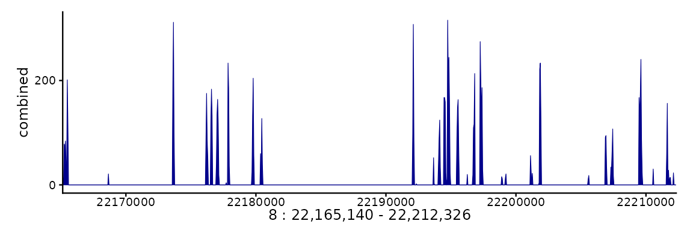

# Visualizing signals in a single region

Abstract

This vignette documents the use of the ‘ggSignalTracks’ to generate
genome-browser-like plots of signals and annotations along genomic
coordinates in a single given region.

## Plotting signals in a region

The
[`ggSignalTracks()`](https://ethz-ins.github.io/epiwraps/reference/ggSignalTracks.md)
function of `epiwraps` plots one or more signals along a given genomic
region, producing `ggplot` objects:

``` r
suppressPackageStartupMessages({
  library(epiwraps)
  library(patchwork)
})

# get the path to an example bigwig file:
bwf1 <- system.file("extdata/example_rna.bw", package="epiwraps")
ggSignalTracks(list(RNA=bwf1), region="8:22165140-22212326")
```

    ## [[1]]


``` r
# we could plot multiple tracks as follows:
pl <- ggSignalTracks(list(track1=bwf1, track2=bwf1), region="8:22165140-22212326")
wrap_plots(pl, ncol=1)
```


`GRanges` objects can also be plotted as annotation tracks alongside
other data:

``` r
myregions <- GRanges("8", IRanges(c(22166000,22202300), width=3000))
pl <- ggSignalTracks(list(RNA=bwf1, regions=myregions), region="8:22165140-22212326")
wrap_plots(pl, ncol=1)
```


Colors, track display types, and such parameters can either be set for
all tracks or for each individual track, for example:

``` r
pl <- ggSignalTracks(list(RNA=bwf1, regions=myregions),
                     region="8:22165140-22212326", colors=c("red", "black"))
wrap_plots(pl, ncol=1)
```


### Merging signal from different tracks

In addition to being displayed one below the other, data tracks can be
combined in different ways. To do this, the tracks can simply be given
in a nested fashion:

``` r
pl <- ggSignalTracks(list(combined=c(bwf1, bwf1)), region="8:22165140-22212326",
                     aggregation="mean")
wrap_plots(pl, ncol=1)
```



In this example we are always using the same track, but the first
element (‘track1’) plots the track alone, while the second (‘combined’)
merges the two given tracks. By default, the mean is shown, but this can
be controlled through the `aggregation` argument. In addition to usual
operations, the tracks can be overlayed on top of one another
(`aggregation='overlay'`), or shown as a heatmap
(`aggregation='heatmap'`), or a mean track with heatmap below
(`aggregation="heatmap+mean"`).

To better illustrate this, we’ll generate two dummy tracks:

``` r
bw1 <- tempfile(fileext=".bw")
cov1 <- GRanges("chr1", IRanges(1L+round(c(500+rnorm(15, sd=20),1000*runif(20))), width=30))
bw2 <- tempfile(fileext=".bw")
cov2 <- GRanges("chr1", IRanges(1L+abs(round(c(490+rnorm(15, sd=30),1000*runif(20)))), width=30))
seqlengths(cov1) <- seqlengths(cov2) <- c("chr1"=1500)
rtracklayer::export.bw(coverage(cov1), bw1)
rtracklayer::export.bw(coverage(cov2), bw2)
```

Then we can plot them as replicates:

``` r
pl <- ggSignalTracks(list(group=c(rep1=bw1, rep2=bw2)), region="chr1:1-1030",
                     aggregation="heatmap+mean") # this is actually the default
wrap_plots(pl, ncol=1)
```


We find this representation particularly useful, as it combines the
visual interpretability of the track, while simultaneously providing
information about the variability across replicates in a compact
fashion.

### Using an EnsDb object

If an `EnsDb` object is available (see the
*[ensembldb](https://bioconductor.org/packages/3.23/ensembldb)* package
for a description of the class and its methods, and the
*[AnnotationHub](https://bioconductor.org/packages/3.23/AnnotationHub)*
package for a convenient way of fetching such annotation objects), two
additional options are available: first, instead of specifying the
region as coordinates, one can specify a gene or transcript name, and
the corresponding region will be fetched. In addition, the genes or
transcripts can be displayed. For example:

``` r
# we fetch the GRCh38 Ensembl 103 annotation (this is not run in the vignette,
# as it takes some time to download the annotation the first time is used):
library(AnnotationHub)
ah <- AnnotationHub()
ensdb <- ah[["AH89426"]]
# we plot our previous RNA bigwig file, around the BMP1 locus:
pl <- ggSignalTracks(list(coverage=bwf1), region="BMP1", ensdb=ensdb,
                     transcripts="full")
# we can adjust the size of the different tracks:
wrap_plots(pl, ncol=1, heights=c(2,5))
```


Now we can see that the coverage is nicely restricted to exons, and that
some transcripts/exons are not expressed as highly as others. The
transcripts could also have been collapsed into a gene model using
`transcripts="collapsed"` (the default).

To display only the gene track, the first argument can simply be empty,
e.g. `ggSignalTracks(list(), region="BMP1", ensdb=ensdb)`.

### Further track customization

The output of
[`ggSignalTracks()`](https://ethz-ins.github.io/epiwraps/reference/ggSignalTracks.md)
is a list of ggplot objects. This means that we can customize individual
panels after they have been generated, before we wrap them together. For
example:

``` r
library(ggplot2)
pl <- ggSignalTracks(list(group=c(rep1=bw1, rep2=bw2)), region="chr1:1-1030")
pl[[1]] <- pl[[1]] + theme(axis.title.y=element_text(colour="darkblue", size=12))
patchwork::wrap_plots(pl, ncol=1, heights=c(3,1)) & 
   theme(axis.title.y=element_text(face="bold"))
```


  
  

## Session info

``` r
sessionInfo()
```

    ## R version 4.6.1 (2026-06-24)
    ## Platform: x86_64-pc-linux-gnu
    ## Running under: Ubuntu 24.04.4 LTS
    ## 
    ## Matrix products: default
    ## BLAS:   /usr/lib/x86_64-linux-gnu/openblas-pthread/libblas.so.3 
    ## LAPACK: /usr/lib/x86_64-linux-gnu/openblas-pthread/libopenblasp-r0.3.26.so;  LAPACK version 3.12.0
    ## 
    ## locale:
    ##  [1] LC_CTYPE=C.UTF-8       LC_NUMERIC=C           LC_TIME=C.UTF-8       
    ##  [4] LC_COLLATE=C.UTF-8     LC_MONETARY=C.UTF-8    LC_MESSAGES=C.UTF-8   
    ##  [7] LC_PAPER=C.UTF-8       LC_NAME=C              LC_ADDRESS=C          
    ## [10] LC_TELEPHONE=C         LC_MEASUREMENT=C.UTF-8 LC_IDENTIFICATION=C   
    ## 
    ## time zone: UTC
    ## tzcode source: system (glibc)
    ## 
    ## attached base packages:
    ## [1] grid      stats4    stats     graphics  grDevices utils     datasets 
    ## [8] methods   base     
    ## 
    ## other attached packages:
    ##  [1] ggplot2_4.0.3               patchwork_1.3.2            
    ##  [3] epiwraps_0.99.125           EnrichedHeatmap_1.42.0     
    ##  [5] ComplexHeatmap_2.28.0       SummarizedExperiment_1.42.0
    ##  [7] Biobase_2.72.0              GenomicRanges_1.64.0       
    ##  [9] Seqinfo_1.2.0               IRanges_2.46.0             
    ## [11] S4Vectors_0.50.1            BiocGenerics_0.58.1        
    ## [13] generics_0.1.4              MatrixGenerics_1.24.0      
    ## [15] matrixStats_1.5.0           BiocStyle_2.40.0           
    ## 
    ## loaded via a namespace (and not attached):
    ##   [1] DBI_1.3.0                bitops_1.0-9             pbapply_1.7-4           
    ##   [4] rlang_1.3.0              magrittr_2.0.5           clue_0.3-68             
    ##   [7] GetoptLong_1.1.1         otel_0.2.0               compiler_4.6.1          
    ##  [10] RSQLite_3.53.3           GenomicFeatures_1.64.0   png_0.1-9               
    ##  [13] systemfonts_1.3.2        vctrs_0.7.3              ProtGenerics_1.44.0     
    ##  [16] pkgconfig_2.0.3          shape_1.4.6.1            crayon_1.5.3            
    ##  [19] fastmap_1.2.0            XVector_0.52.0           labeling_0.4.3          
    ##  [22] Rsamtools_2.28.0         rmarkdown_2.31           UCSC.utils_1.8.0        
    ##  [25] ragg_1.5.2               bit_4.6.0                xfun_0.60               
    ##  [28] cachem_1.1.0             cigarillo_1.2.0          GenomeInfoDb_1.48.0     
    ##  [31] jsonlite_2.0.0           blob_1.3.0               DelayedArray_0.38.2     
    ##  [34] BiocParallel_1.46.0      parallel_4.6.1           cluster_2.1.8.2         
    ##  [37] VariantAnnotation_1.58.0 R6_2.6.1                 bslib_0.11.0            
    ##  [40] RColorBrewer_1.1-3       rtracklayer_1.72.0       jquerylib_0.1.4         
    ##  [43] Rcpp_1.1.2               bookdown_0.47            iterators_1.0.14        
    ##  [46] knitr_1.51               Matrix_1.7-5             tidyselect_1.2.1        
    ##  [49] dichromat_2.0-0.1        abind_1.4-8              yaml_2.3.12             
    ##  [52] doParallel_1.0.17        codetools_0.2-20         curl_7.1.0              
    ##  [55] lattice_0.22-9           tibble_3.3.1             withr_3.0.3             
    ##  [58] KEGGREST_1.52.2          S7_0.2.2                 evaluate_1.0.5          
    ##  [61] desc_1.4.3               circlize_0.4.18          Biostrings_2.80.1       
    ##  [64] pillar_1.11.1            BiocManager_1.30.27      foreach_1.5.2           
    ##  [67] RCurl_1.98-1.19          ensembldb_2.36.1         scales_1.4.0            
    ##  [70] GenomicFiles_1.48.0      glue_1.8.1               lazyeval_0.2.3          
    ##  [73] tools_4.6.1              BiocIO_1.22.0            data.table_1.18.4       
    ##  [76] BSgenome_1.80.0          locfit_1.5-9.12          GenomicAlignments_1.48.0
    ##  [79] XML_3.99-0.23            fs_2.1.0                 AnnotationDbi_1.74.0    
    ##  [82] colorspace_2.1-2         restfulr_0.0.17          cli_3.6.6               
    ##  [85] textshaping_1.0.5        viridisLite_0.4.3        S4Arrays_1.12.0         
    ##  [88] dplyr_1.2.1              AnnotationFilter_1.36.0  gtable_0.3.6            
    ##  [91] sass_0.4.10              digest_0.6.39            SparseArray_1.12.2      
    ##  [94] rjson_0.2.23             htmlwidgets_1.6.4        farver_2.1.2            
    ##  [97] memoise_2.0.1            htmltools_0.5.9          pkgdown_2.2.1           
    ## [100] lifecycle_1.0.5          httr_1.4.8               GlobalOptions_0.1.4     
    ## [103] bit64_4.8.2
