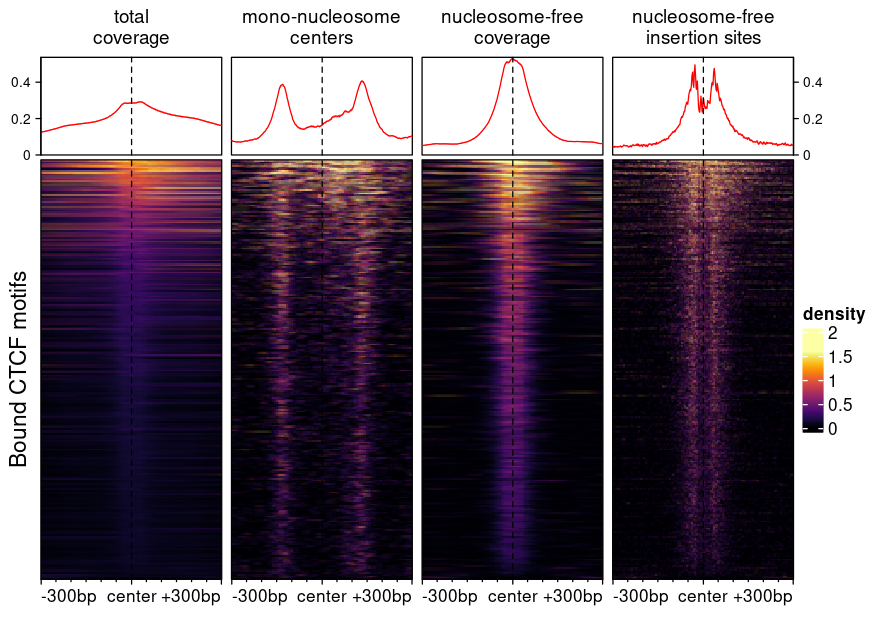

```{r, include=FALSE}
library(BiocStyle)
```

# Introduction

The `bam2bw` function can be used to compute per-nucleotide or per-bin coverage 
from alignments and save it to a bigwig file. In this process, information about
individual reads is lost, but the produced signals are considerably more 
lightweight and amenable to visualization. The bigwig format is readily queried
from R or compatible with a variety of tools, including genome browsers.

## Many way of compiling coverage

To introduce the different variations on coverage, let's assume you've go the 
following single-end reads:

```{r, fig.height=1, fig.width=4}
library(epiwraps)
gr <- GRanges("chr1", IRanges(c(30,70,120), width=50), strand=c("+","+","-"),
              seqlengths=c(chr1=500))
plotSignalTracks(list(reads=gr), region="chr1:1:180", extend=0, genomeAxis=FALSE)
```

For testing purposes, we'll save this as a bam file and index it:

```{r}
bam <- tempfile(fileext = ".bam") # temp file name
rtracklayer::export(gr, bam, format="bam")
Rsamtools::indexBam(bam)
```

Using these example reads, we can illustrate different ways of computing coverages.

First, we can save coverage at different resolutions, from full resolution 
(each nucleotide is a single bin) to larger bin sizes, the latter giving smaller
filesizes:

```{r, fig.width=4.5, fig.height=2.5}
# Full coverage with bin width of 1 nucleotide (i.e. full resolution)
cov_full_bw1 <- tempfile(fileext = ".bw") # temp file name
bam2bw(bam, cov_full_bw1, binWidth=1L, scaling=FALSE)
# Full coverage with larger bins
cov_full_bw25 <- tempfile(fileext = ".bw")
bam2bw(bam, cov_full_bw25, binWidth=25L, scaling=FALSE)
plotSignalTracks(list(reads=gr, "binWidth=1"=cov_full_bw1, "binWidth=25"=cov_full_bw25),
                 region="chr1:1:180", extend=0)
```

Both tracks compile the number of reads that overlap each position, but in the 
bottom track the signal is by chunks of 25 nucleotides. By default, the maximum 
signal inside a bin is used, however it is possible to change this:

```{r, fig.width=4.5, fig.height=3.5}
# Using mean per bin:
cov_full_bw25mean <- tempfile(fileext = ".bw")
bam2bw(bam, cov_full_bw25mean, binWidth=25L, binSummarization = "mean", scaling=FALSE)
plotSignalTracks(list(reads=gr, "binWidth=1"=cov_full_bw1, 
                      "binWidth=25\n(max)"=cov_full_bw25,
                      "binWidth=25\n(mean)"=cov_full_bw25mean),
                 region="chr1:1:180", extend=0)
```

In most cases, single-end reads are just the beginning of the DNA fragments 
obtained, and in most cases we know the average size of the fragments (if not, 
see the `estimateFragSize` function, or the simpler `estimate.mean.fraglen` 
function of the `r BiocStyle::Biocpkg("chipseq")` package). It is therefore 
common to extend reads to this size when computing coverage, so as to obtain
the number of fragments (rather than reads) coverage each position. This can be
done as follows:

```{r, fig.width=4.5, fig.height=2.5}
# Here the reads are 50bp, and we want to extend them to 100bp, hence _by_ 50:
cov_full_ext <- tempfile(fileext = ".bw")
bam2bw(bam, cov_full_ext, binWidth=1L, extend=50L, scaling=FALSE)
plotSignalTracks(list(reads=gr, "no extension"=cov_full_bw1, 
                      "read extension"=cov_full_ext),
                 region="chr1:1:190", extend=0)

```

Instead of computing coverage, we could compute the number of reads starting, 
ending, or being centered at each position:

```{r, fig.width=4.5, fig.height=3.5}
# Here the reads are 50bp, and we want to extend them to 100bp, hence _by_ 50:
cov_start <- tempfile(fileext = ".bw")
bam2bw(bam, cov_start, binWidth=1L, extend=50L, scaling=FALSE, type="start")
cov_center <- tempfile(fileext = ".bw")
bam2bw(bam, cov_center, binWidth=1L, extend=50L, scaling=FALSE, type="center")

plotSignalTracks(list(reads=gr, "type=full"=cov_full_bw1, 
                      "type=start"=cov_start, "type=center"=cov_center),
                 region="chr1:1:190", extend=0)

```
Note that when extending reads, as in this case, the position (e.g. "center") are
relative to the extended read (i.e. extension is applied first).


## Example heatmaps created using different bigwig generation procedures

The following figure, created using `epiwraps` (see 
<a href="multiRegionPlot.html">the vignette on generating such plots</a>), 
represent chromatin accessibility (ATAC-seq) signals around bound CTCF motifs 
in T-cells. The different signals are based on different bigwig files derived 
from the same bam file using the functions described above.



* The first heatmap ('full coverage') was generated with default parameter, and
is the fragment coverage (i.e. how many fragments overlap any given location).
* The second heatmap shows the fragment of sizes compatible with mono-nucleosomes,
resizing fragments from their centers. The exact arguments used were 
`shift=c(4L,-5L), minFragLength=147, maxFragLength=230, type="center", extend=10L`.
Using this we can see nucleosomes well-positioned at some distance from CTCF 
binding sites, but not nucleosome at the bound site itself.
* The third shows the coverage of nucleosome-free fragments, in this case it 
was used with `shift=c(4L,-5L), maxFragLength=120`.
* The fourth shows where the transposase inserted itself, and was 
generated with 
`shift=c(4L,-5L), binWidth=1L, maxFragLength=120, type="ends"`. Using this we 
can see a nice footprint protected from the transposase by CTCF binding.

# Working with fragment files as an input

If you use fragment files (preferably tabix-indexed) rather than bam files as 
input, you can still perform most of the above tasks. See the `?frag2bw` 
function for more information.